# Architecture

System architecture for Private Battleship. Covers account relationships, instruction flows, CPI interactions, frontend orchestration, and design decisions.

[Back to README](README.md)

## System Overview

The program runs across two execution contexts: Solana L1 (base layer) and MagicBlock's TEE (Trusted Execution Environment running Intel TDX). Accounts are created on L1, delegated to the TEE for private gameplay, then committed back to L1 for settlement.

```mermaid
graph TD
    subgraph Frontend["Frontend - Next.js 16.2.2"]
        UG["useGame.ts - 2040 lines"]
        GL["GameLobby - create/join"]
        PL["Placement - place_ships"]
        BT["Battle - fire"]
        RS["Result - settle/claim"]
    end
    subgraph L1["Solana Devnet - Base Layer"]
        CG["create_game"]
        JG["join_game"]
        DB["delegate_board x2"]
        DGS["delegate_game_state"]
        RTO["request_turn_order"]
        RSK["register_session_key"]
        CP["claim_prize"]
        VB["verify_board"]
    end
    subgraph TEELayer["TEE Validator - Intel TDX PER"]
        TEEID["FnE6VJT5QNZdedZPnCoLsARgBwoE6DeJNjBs2H1gySXA"]
        PS["place_ships - writes to private PlayerBoard"]
        FI["fire - reads private board, writes public hits"]
        SG["settle_game - commits game + both boards to L1"]
    end
    GL -->|"Batched TX, 1 popup"| CG
    PL -->|"Session Key, 0 popups"| PS
    BT -->|"Session Key, 0 popups"| FI
    RS -->|"Session Key"| SG
    RS -->|"Session Key"| CP
```

## Directory Structure

```
solana-blitz-v3/
├── programs/battleship/src/
│   └── lib.rs                       # 1796 lines - Solana program (19 instructions, 36 errors)
├── app/                             # Frontend application
│   └── src/
│       ├── app/
│       │   ├── layout.tsx           # Root layout + wallet provider
│       │   └── page.tsx             # Phase router
│       ├── components/              # 10 components
│       │   ├── BattleGrid.tsx       # 330 lines
│       │   ├── BattlePhase.tsx      # 159 lines
│       │   ├── DebugLogButton.tsx   #  23 lines
│       │   ├── GameBackground.tsx   # 148 lines
│       │   ├── GameLobby.tsx        # 184 lines
│       │   ├── HeroVideo.tsx        #  27 lines
│       │   ├── PlacementPhase.tsx   # 356 lines
│       │   ├── ResultPhase.tsx      # 157 lines
│       │   ├── TransactionLog.tsx   #  69 lines
│       │   └── wallet-provider.tsx  #  36 lines
│       ├── hooks/
│       │   └── useGame.ts           # 2040 lines
│       └── lib/                     # 6 utility modules
│           ├── program.ts           # 126 lines
│           ├── tee-connection.ts    # 105 lines
│           ├── debug-logger.ts      #  90 lines
│           ├── board-hash.ts        #  36 lines
│           ├── sfx.ts              #  69 lines
│           ├── oracle.ts            #  25 lines
│           └── idl.json             # Anchor IDL (auto-generated)
├── Anchor.toml
├── Cargo.toml
└── rust-toolchain.toml              # Rust 1.89.0
```

Total frontend: 4334 lines across all files.

## Game Lifecycle Sequence Diagram

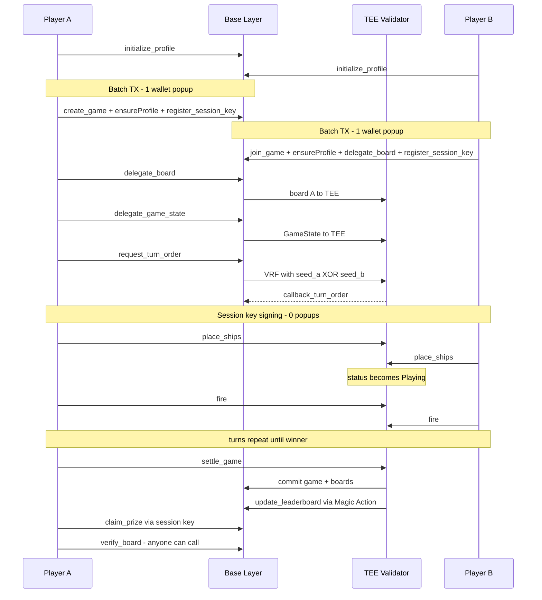

## Account Relationships (ER Diagram)

5 account types. Fixed-size arrays throughout (no Vec).

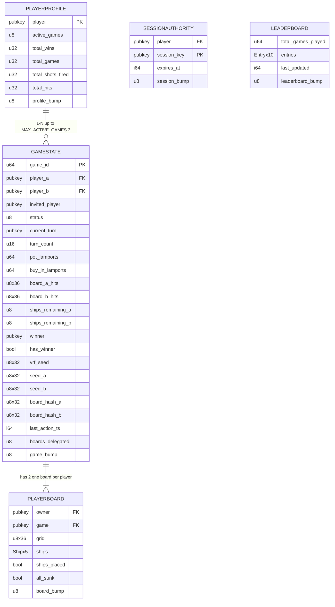

| Account | Size | PDA Seeds | Delegation | Notes |
|---|---|---|---|---|
| PlayerProfile | 58 bytes | `["profile", player]` | Never delegated | One per player, lives on L1. Tracks lifetime stats and concurrent game limit. |
| GameState | 446 bytes | `["game", player_a, game_id]` | Public TEE | Delegated to TEE validator. |
| PlayerBoard | 136 bytes | `["board", game, player]` | Private TEE | Private ACL, owner-only reads inside TEE. |
| SessionAuthority | 113 bytes | `["session", player, session_pubkey]` | Never delegated | One per player per game session. Expires after MAX_SESSION_DURATION (3600s). |
| Leaderboard | 455 bytes | `["leaderboard"]` | Never delegated | Global singleton. Updated via Magic Action on settle_game. |

Field details:
- Grid values: 0=empty, 1=ship, 2=hit_ship, 3=miss_water
- Ship: start_row, start_col, size, horizontal, hits
- LeaderboardEntry: player, wins, total_games, accuracy_bps, is_active (43 bytes each)

## Privacy Architecture

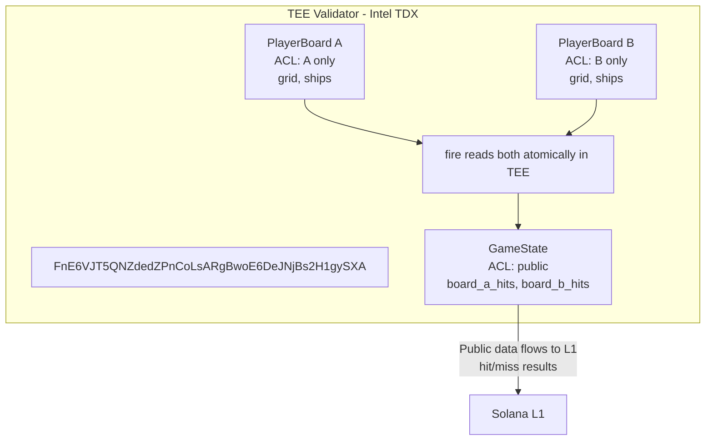

**Data visibility by role:**

| Data | Owner | Opponent | Validator | Public after settle |
|---|---|---|---|---|
| Ship positions | Yes | No | No (TEE only) | Yes |
| Hit/miss results | Yes | Yes | Yes (public GameState) | Yes |
| Board hash | Yes | Yes | Yes | Yes |
| Salt | Yes (local) | No | No | No |

**Post-game:** settle_game commits boards to L1, all data becomes public, verify_board proves hash integrity.

Three layers of privacy protection:

1. **TEE Hardware Isolation**: PlayerBoard accounts have private ACLs. Only the owner's auth token (signed by their wallet) can read the data. The TEE validator enforces this at the hardware level via Intel TDX.

2. **Same Execution Context**: All accounts (GameState, Board A, Board B) delegate to the same TEE validator. The `fire` instruction atomically reads the opponent's private board and writes the hit/miss result to the public GameState within one transaction.

3. **Commit-Reveal Verification**: Before the game starts, each player commits `SHA256(ships || salt)` to the GameState. After the game ends, anyone can call `verify_board` with the original placements and salt to prove the TEE did not modify ship positions.

## Commit-Reveal Verification Flow

```mermaid
graph LR
    subgraph Before["Before Game - Client"]
        S1["1. Generate salt<br/>32 random bytes"]
        S2["2. board_hash =<br/>SHA256 of ships + salt"]
        S3["Hash committed to<br/>GameState on L1<br/>via create_game or join_game"]
        S1 --> S2 --> S3
    end
    subgraph During["During Game - TEE"]
        S4["3. place_ships writes ships<br/>to private PlayerBoard<br/>inside TEE"]
        S5["4. fire reads boards<br/>atomically in<br/>same TEE context"]
        S4 --> S5
    end
    subgraph After["After Game - Base Layer"]
        S6["5. Boards committed<br/>to L1 by settle_game"]
        S7["6. Anyone calls<br/>verify_board with<br/>placements and salt"]
        S8["7. Recompute SHA256<br/>of placements + salt"]
        S9["8. Compare to stored<br/>hash on GameState"]
        S10{"9. Match?"}
        VALID["VALID"]
        TAMPERED["BoardTampered - error 6022"]
        S6 --> S7 --> S8 --> S9 --> S10
        S10 -->|"Yes"| VALID
        S10 -->|"No"| TAMPERED
    end
    S3 --> S4
    S5 --> S6
```

## VRF Turn Order Flow

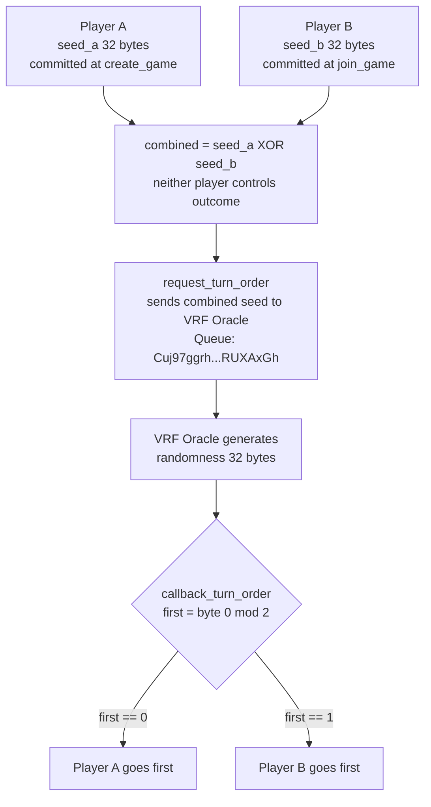

## Fire Instruction Flow

The fire instruction does not write to PlayerProfile. Per-shot stats are computed during `update_leaderboard` (Magic Action on settlement).

### Validation

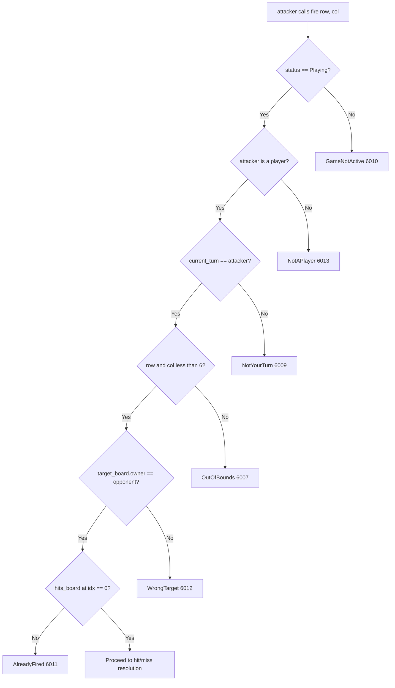

### Hit/Miss Resolution

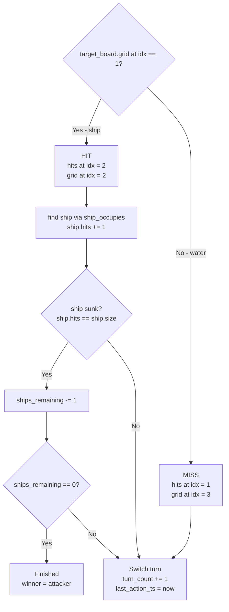

## Session Key Flow

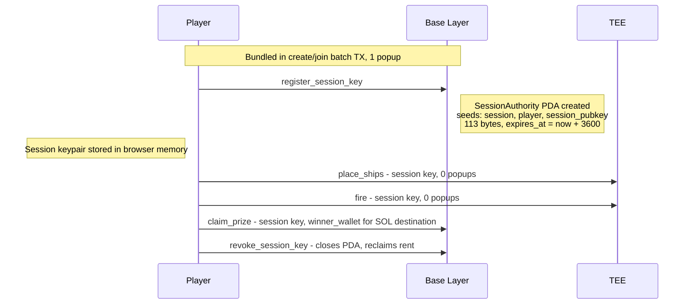

Session key preservation: if a transaction fails and is retried, the existing session keypair is reused, not regenerated.

## Frontend Orchestration (TX Batching)

### Player A Flow

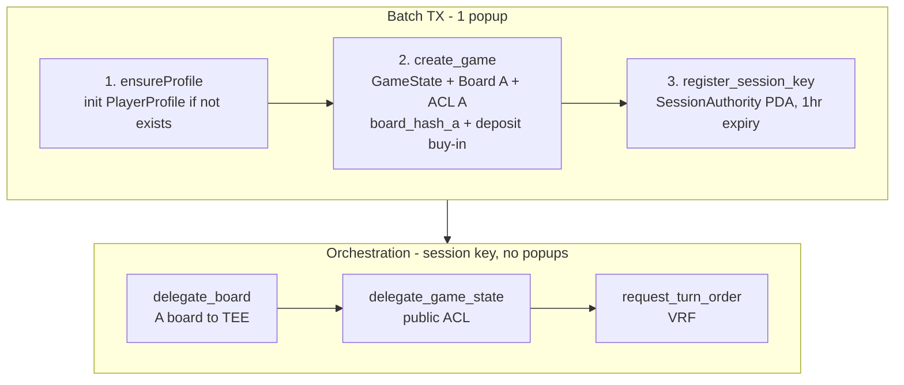

### Player B Flow

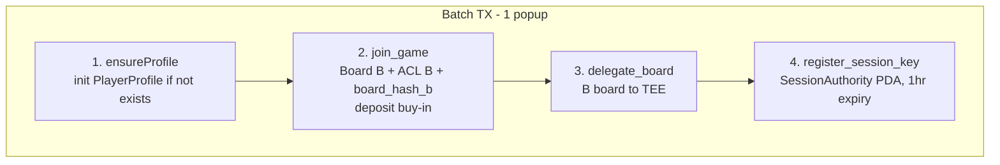

### Stale Profile Recovery

Before submitting the batch TX, the frontend checks the player's profile. If `active_games >= 3`, it runs `autoClaimTimeouts`. If zero actual games are found on-chain, it calls `reset_active_games` to zero out the counter. This prevents permanent lockout from the MAX_ACTIVE_GAMES (3) cap.

## Auto End-Game Flow

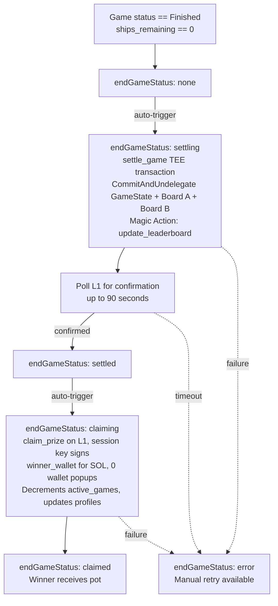

The endGameStatus values: `none`, `settling`, `settled`, `claiming`, `claimed`, `error`.

## Timeout Logic Flow

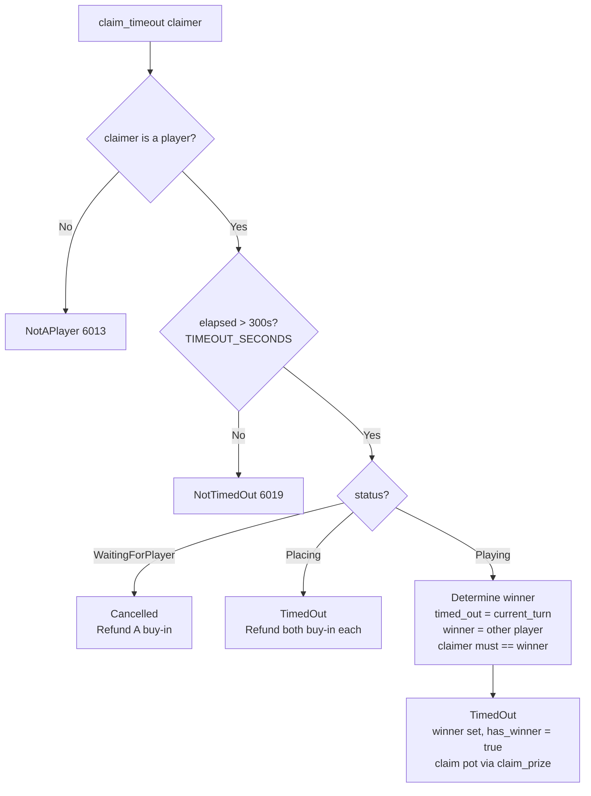

## Settlement Flow

settle_game commits GameState and both boards to L1 via CommitAndUndelegate. No permission CPIs. ACLs only matter within the TEE execution context. Once committed to L1, data is inherently public.

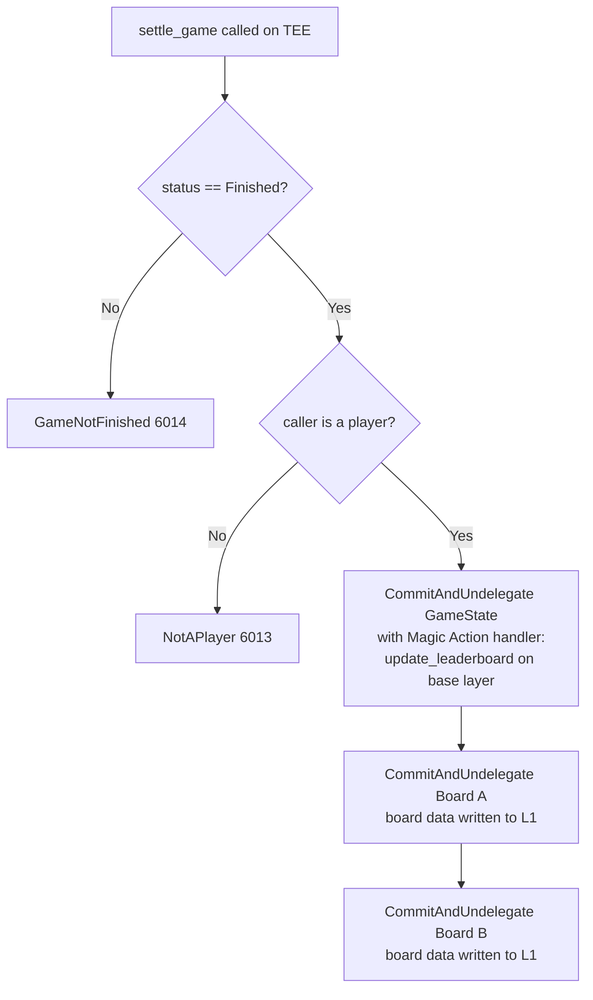

## CPI Call Map

| Instruction | CPI Target | Purpose |
|---|---|---|
| `create_game` | System Program | Transfer buy-in lamports to GameState PDA |
| `create_game` | Permission Program (`ACLseoPoyC3cBqoUtkbjZ4aDrkurZW86v19pXz2XQnp1`) | CreatePermission for Board A (private ACL) |
| `join_game` | System Program | Transfer buy-in lamports to GameState PDA |
| `join_game` | Permission Program | CreatePermission for Board B (private ACL) |
| `delegate_board` | Permission Program | DelegatePermission for player's board to TEE |
| `delegate_board` | Delegation Program (`DELeGGvXpWV2fqJUhqcF5ZSYMS4JTLjteaAMARRSaeSh`) | Delegation record + buffer + metadata |
| `delegate_game_state` | Permission Program | CreatePermission (public) + DelegatePermission for GameState |
| `delegate_game_state` | Delegation Program | Delegation record + buffer + metadata |
| `request_turn_order` | VRF Program (`Vrf1RNUjXmQGjmQrQLvJHs9SNkvDJEsRVFPkfSQUwGz`) | Request randomness with combined seed |
| `settle_game` | Magic Program (`Magic11111111111111111111111111111111111111`) | CommitAndUndelegate GameState + both boards |
| `settle_game` | Battleship Program (self, `9DiCaM3ugtjo1f3xoCpG7Nxij112Qc9znVfjQvT6KHRR`) | Magic Action: update_leaderboard |
| `claim_prize` | (none, direct lamport manipulation) | Transfer pot to winner |
| `cancel_game` | (none, direct lamport manipulation) | Refund buy-in to Player A |
| `claim_timeout` | (none, direct lamport manipulation) | Refund or award pot |

## Technology Stack

| Layer | Technology | Version |
|---|---|---|
| Blockchain | Solana | devnet |
| Smart contract framework | Anchor | 0.32.1 |
| Language (program) | Rust | 1.89.0 |
| Solana runtime | solana-program | 2.2.1 |
| TEE runtime | MagicBlock Ephemeral Rollups (PER) | SDK 0.8.6 |
| Privacy | MagicBlock Private ER (Intel TDX ACLs) | via Permission Program |
| Randomness | MagicBlock VRF | SDK 0.2.3 |
| Atomic settlement | MagicBlock Magic Actions | via Magic Program |
| Price feed | MagicBlock Pricing Oracle | frontend stub |
| Frontend framework | Next.js | 16.2.2 |
| UI library | React | 19.2.4 |
| Type system | TypeScript | ^5 |
| Styling | Tailwind CSS | 4 |
| Animation | Framer Motion | ^12.38.0 |
| Wallet | Phantom (via @solana/wallet-adapter) | - |
| Hashing (client) | @noble/hashes | ^1.8.0 |
| Signing (TEE auth) | tweetnacl | ^1.0.3 |
| Solana client | @solana/web3.js | ^1.98.4 |
| Anchor client | @coral-xyz/anchor | ^0.32.1 |
| ER client | @magicblock-labs/ephemeral-rollups-sdk | ^0.10.3 |

## Design Decisions

### Fixed arrays instead of Vec

All on-chain data structures use fixed-size arrays: `ships: [Ship; 5]`, `grid: [u8; 36]`, `entries: [LeaderboardEntry; 10]`. This makes account sizes deterministic and avoids realloc issues with delegated accounts. The `#[ephemeral]` macro requires the `disable-realloc` feature.

### Oracle in frontend only

The Pricing Oracle displays SOL/USD equivalent in the game lobby. The contract deals exclusively in lamports. This avoids price-drift vulnerabilities where an Oracle price change between create_game and claim_prize could cause accounting errors.

### Single hook architecture

All game state, subscriptions, and transaction logic lives in `useGame.ts` (2040 lines). Components are pure rendering. This keeps data flow unidirectional and makes it straightforward to reason about state transitions.

### TX batching for minimal popups

Player A's entire setup (profile + game + session key) goes in one transaction, one wallet popup. Player B's setup (profile + join + delegate board + session key) also goes in one popup. After that, session keys handle all signing.

### Session keys instead of repeated wallet approvals

`register_session_key` creates a SessionAuthority PDA (113 bytes) with a 3600-second expiry. The session keypair is generated in the browser and stored in memory. `fire()`, `place_ships()`, and `claim_prize()` all use the session key. The user never sees another wallet popup after the initial setup.

### CommitAndUndelegate without permission CPIs

`settle_game` commits GameState and both boards to L1 via CommitAndUndelegate. It does not call permission CPIs to update ACLs. The private ACLs only matter within the TEE execution context. Once data is committed to L1, it is inherently public (anyone can read Solana account data).

### Per-shot stats on settlement, not per-fire

`fire()` does not write to PlayerProfile. Shot stats (total_shots_fired, total_hits) are computed and written during `update_leaderboard`, which runs as a Magic Action on the base layer during settlement. This avoids extra account lookups on every fire instruction in the TEE.

### Stale profile recovery

If a player's `active_games` count reaches the maximum (3) but they have no actual active games (games cancelled or timed out without proper cleanup), `autoClaimTimeouts` runs `reset_active_games` to reset the counter. This prevents players from getting permanently locked out.

### 17 constants

The program defines 17 constants: 6 PDA seeds (`GAME_SEED`, `BOARD_SEED`, `PROFILE_SEED`, `LEADERBOARD_SEED`, `SESSION_SEED`, `IDENTITY_SEED`), 5 account sizes (`GAME_STATE_SIZE` = 446, `PLAYER_BOARD_SIZE` = 136, `PLAYER_PROFILE_SIZE` = 58, `LEADERBOARD_SIZE` = 455, `SESSION_AUTHORITY_SIZE` = 113), 5 game rules (`TIMEOUT_SECONDS` = 300, `MIN_BUY_IN` = 1,000,000, `MAX_BUY_IN` = 100,000,000,000, `MAX_ACTIVE_GAMES` = 3, `MAX_LEADERBOARD_ENTRIES` = 10), and 1 session config (`MAX_SESSION_DURATION` = 3600).
