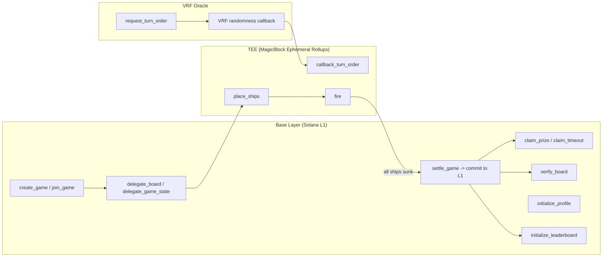
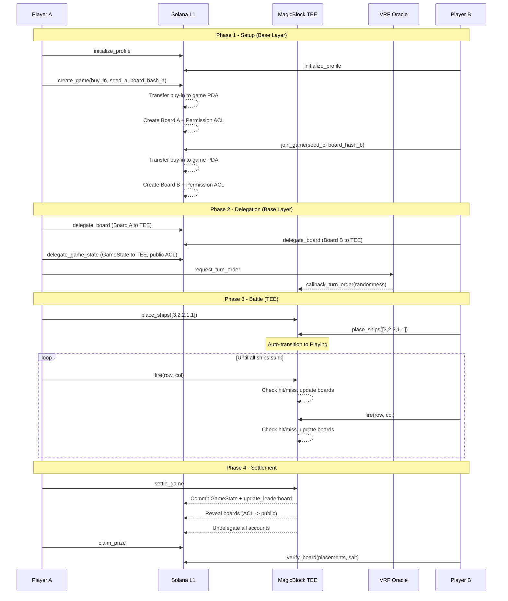
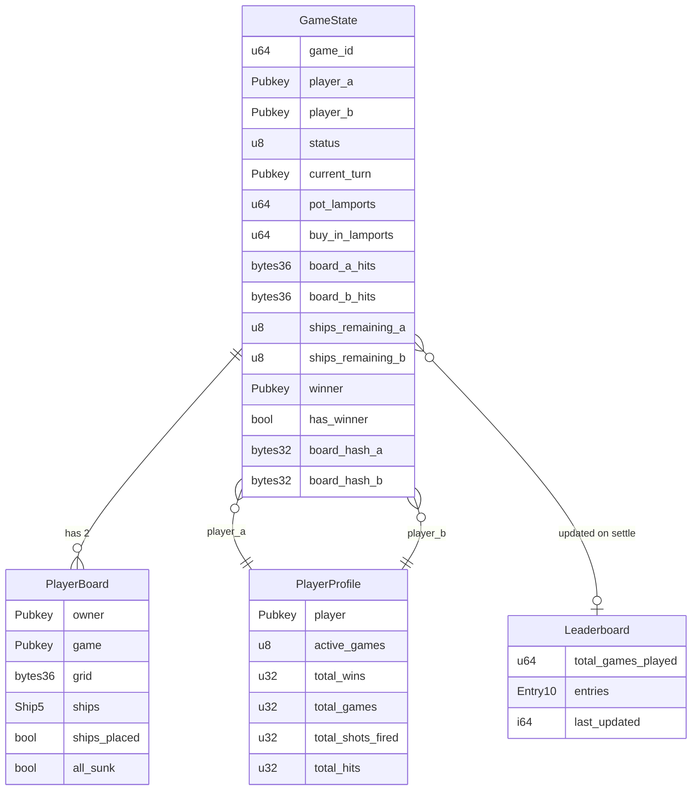
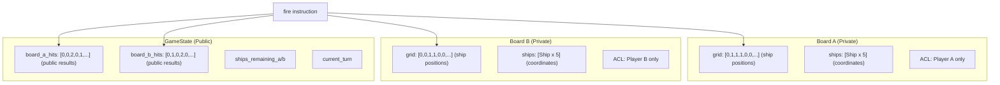
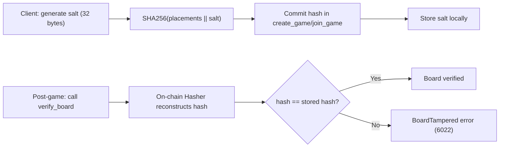
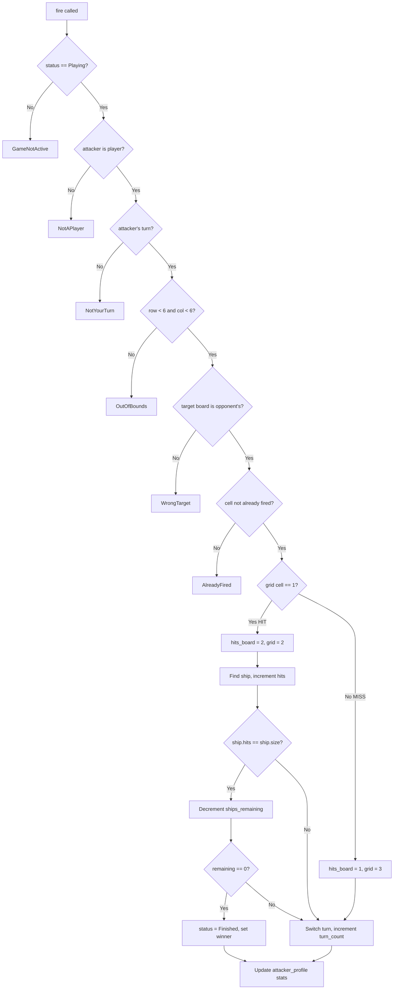

# Architecture

[Back to README](README.md)

## System Overview

The program runs across two execution contexts: Solana L1 (base layer) and MagicBlock's TEE (Trusted Execution Environment). Accounts are created on L1, delegated to the TEE for private gameplay, then committed back to L1 for settlement.



## Directory Structure

```
battleship/
  Anchor.toml                          # Workspace config (localnet, program ID)
  Cargo.toml                           # Workspace-level Cargo config
  rust-toolchain.toml                  # Rust 1.89.0
  programs/
    battleship/
      Cargo.toml                       # anchor-lang 0.32.1, SDK deps
      src/
        lib.rs                         # All 16 instructions, 4 accounts, 27 errors (1469 lines)
  app/
    package.json                       # Next.js 16.2.2, React 19.2.4
    src/
      app/
        layout.tsx                     # Root layout, fonts, WalletProvider
        page.tsx                       # Phase-based routing
        globals.css                    # Dark theme (#070a0f), grid pattern
      components/
        BattleGrid.tsx                 # 6x6 grid with motion animations
        BattlePhase.tsx                # Two grids + turn indicator + TX log
        GameLobby.tsx                  # Create/join game forms
        PlacementPhase.tsx             # Ship placement with rotation
        ResultPhase.tsx                # Winner banner, claim, verify
        TransactionLog.tsx             # Color-coded TX entries
        wallet-provider.tsx            # Phantom adapter, devnet
      hooks/
        useGame.ts                     # Game lifecycle state machine
      lib/
        tee-connection.ts              # TEE auth with 240s refresh
        board-hash.ts                  # SHA-256 commit-reveal hash
        oracle.ts                      # SOL/USD price display
  tests/
    battleship.ts                      # Anchor test file (scaffold)
  migrations/
    deploy.ts                          # Deploy script (scaffold)
```

## Game Lifecycle



## Account Relationships



## Privacy Architecture

The TEE (Intel TDX) ensures ship positions stay hidden during gameplay. The Permission Program controls who can read delegated accounts.



The `fire` instruction runs inside the TEE. It reads the opponent's private board grid (only possible because both boards are delegated to the same TEE execution context), determines hit or miss, then writes the result to the public GameState hit boards. The actual ship positions never leave the TEE.

## Commit-Reveal Verification



The hash uses `solana_program::hash::Hasher` (incremental SHA-256). Each ship placement is fed as 4 bytes `[start_row, start_col, size, horizontal]`, then the 32-byte salt. The client-side `@noble/hashes/sha256` produces identical output over the same byte sequence.

## VRF Turn Order

Neither player can manipulate who goes first. Both contribute a 32-byte seed at game creation/join time. The combined seed is `seed_a XOR seed_b`, which is passed to the VRF oracle. The oracle returns 32 bytes of randomness. `randomness[0] % 2` determines the first player (0 = player A, 1 = player B).

## Fire Instruction Flow

The most complex single instruction. It validates 6 conditions, determines hit/miss, tracks ship damage, checks win condition, switches turn, and updates profile stats.



## Technology Stack

| Layer | Technology | Version |
|-------|-----------|---------|
| Blockchain | Solana (Agave) | 3.1.9 |
| Smart Contract | Anchor | 0.32.1 |
| TEE | MagicBlock Ephemeral Rollups SDK | 0.8.6 |
| VRF | MagicBlock VRF SDK | 0.2.3 |
| Rust | stable | 1.89.0 |
| Platform Tools | SBF | v1.52 |
| Frontend | Next.js (App Router) | 16.2.2 |
| React | React | 19.2.4 |
| CSS | Tailwind CSS | 4.x |
| Animations | framer-motion | 12.x |
| Hashing | @noble/hashes (SHA-256) | 2.x |

## Design Decisions

**Fixed arrays over Vec.** All account data uses fixed-size arrays (`[u8; 36]`, `[Ship; 5]`, `[LeaderboardEntry; 10]`) instead of Vec. This makes account sizes predictable and avoids realloc complexity in the TEE.

**Status as u8.** GameStatus is stored as `u8` rather than the enum directly. This avoids borsh serialization alignment issues and makes on-chain comparisons simpler.

**Separate hit boards.** `board_a_hits` and `board_b_hits` live on the public GameState rather than the private boards. This lets spectators follow the game without reading private data.

**Oracle is frontend-only.** The pricing oracle converts SOL amounts to USD for display. The contract only deals in lamports. This avoids price-drift vulnerabilities where an oracle manipulation could affect pot calculations.

**commit-reveal over zero-knowledge.** ZK proofs would be heavier. Commit-reveal with TEE provides practical privacy with a simpler implementation. The tradeoff: you trust the TEE during gameplay, but can verify after the fact.

[Back to README](README.md)
