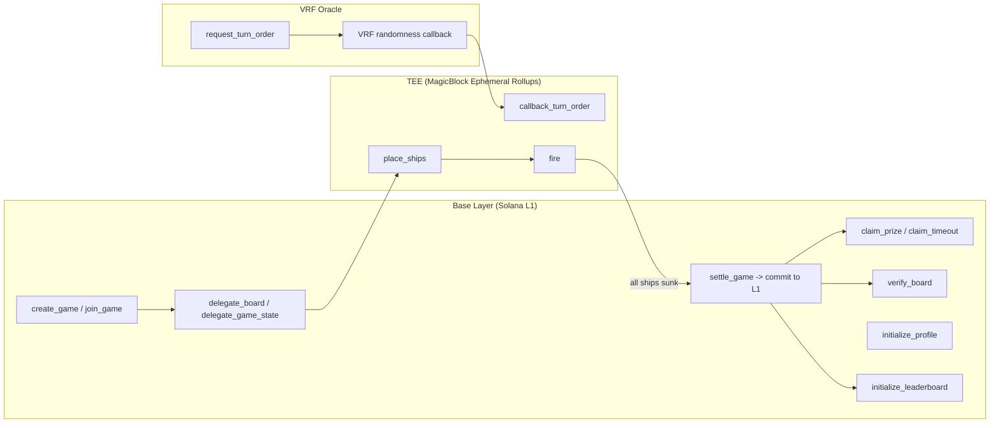
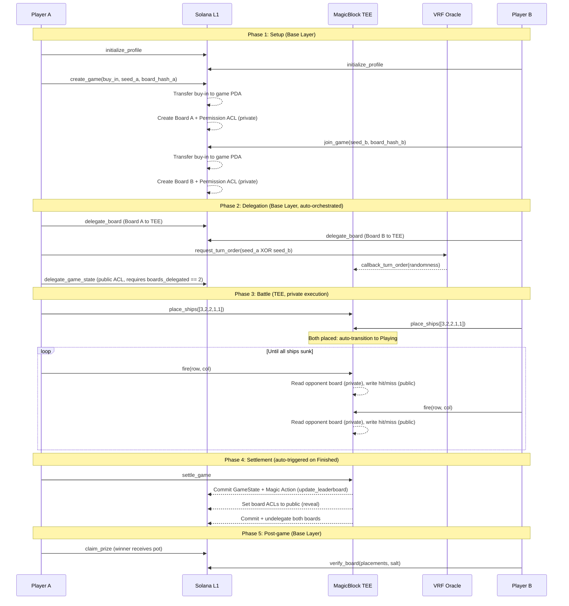
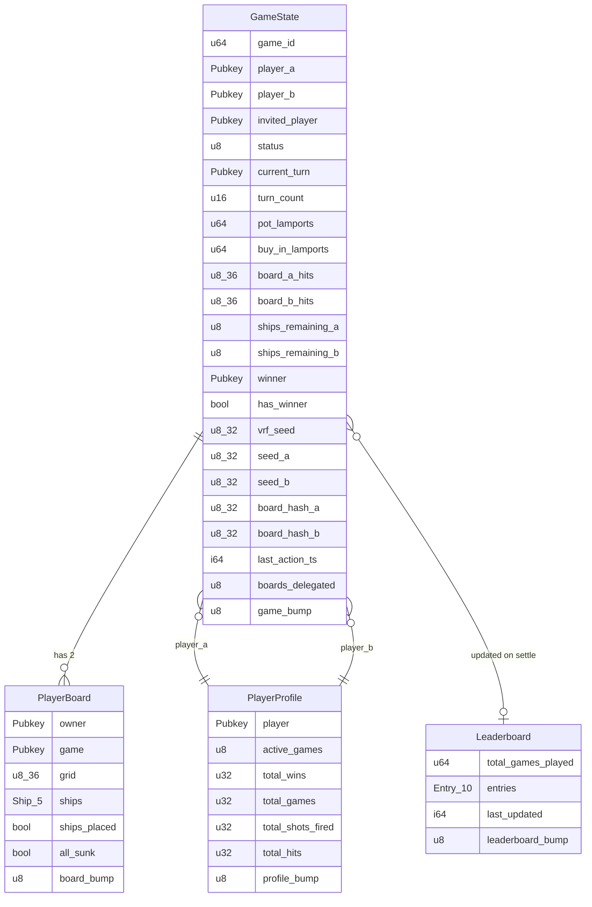
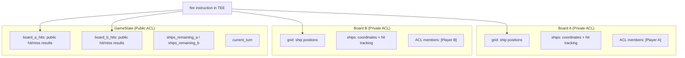
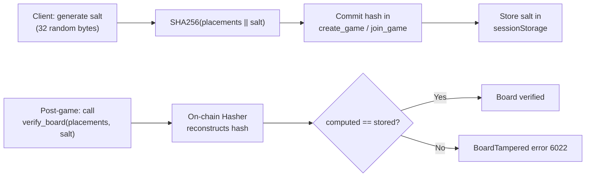
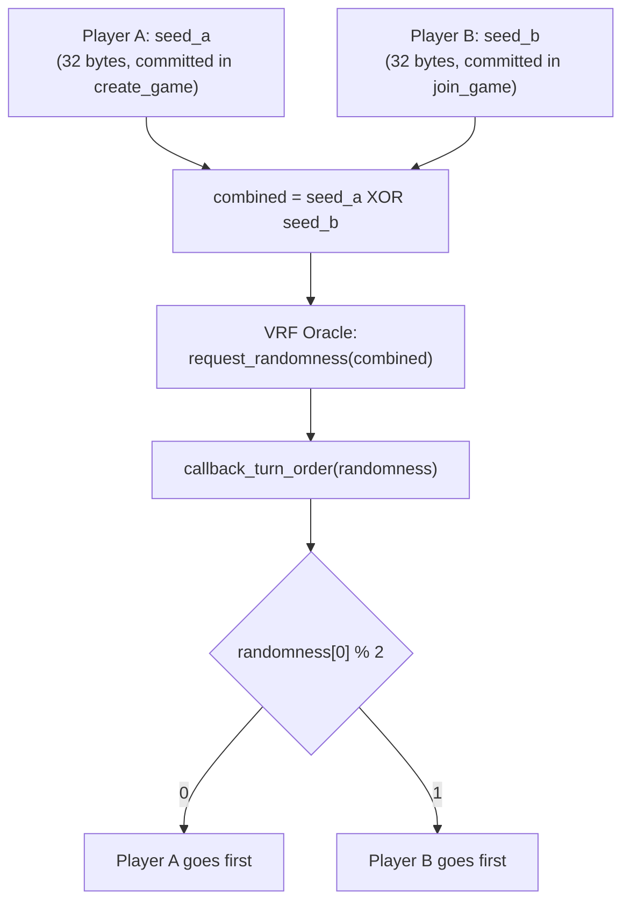
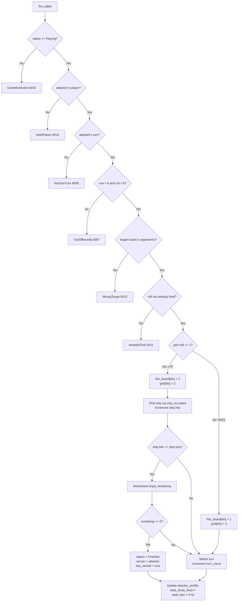
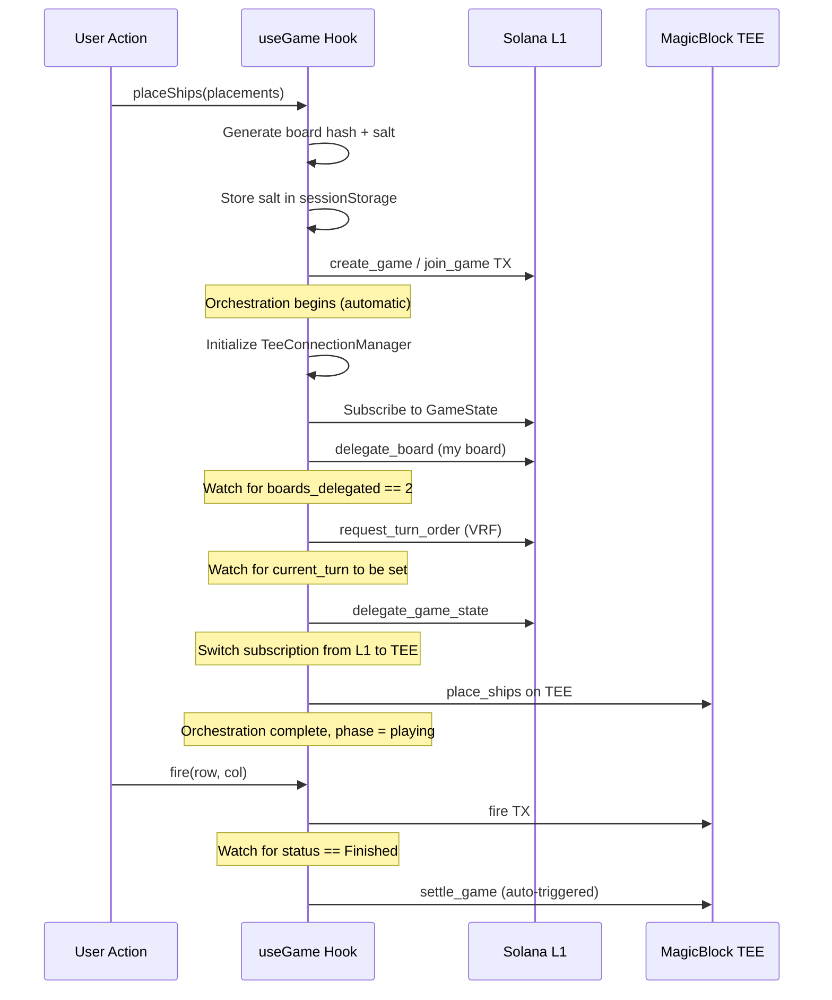
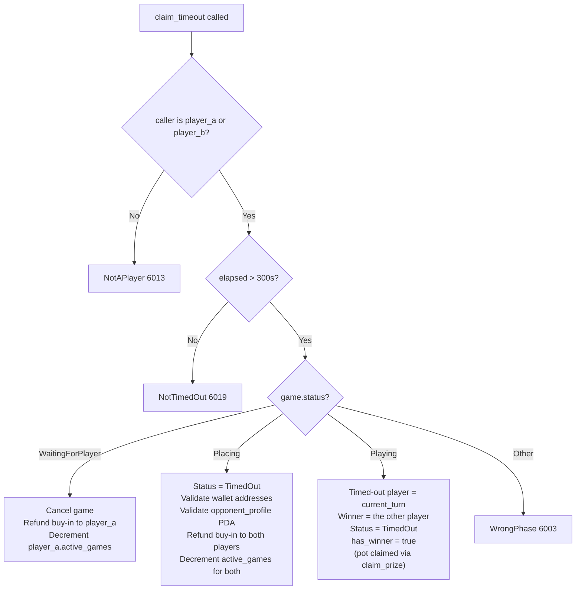
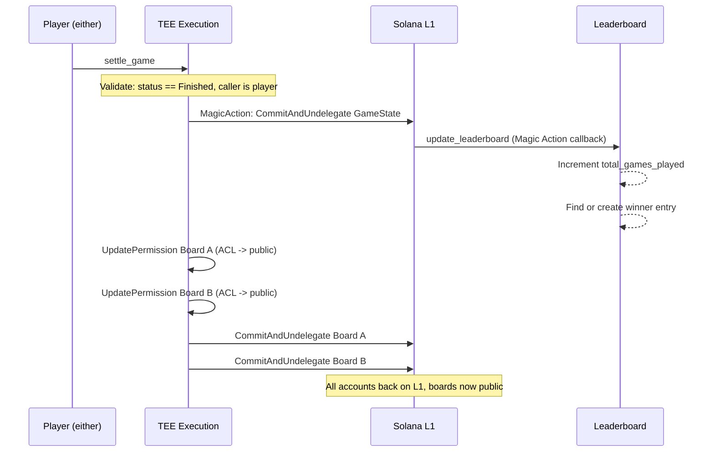

# Architecture

[Back to README](README.md)

## System Overview

The program runs across two execution contexts: Solana L1 (base layer) and MagicBlock's TEE (Trusted Execution Environment running Intel TDX). Accounts are created on L1, delegated to the TEE for private gameplay, then committed back to L1 for settlement.



## Directory Structure

```
solana-blitz-v3/
  Anchor.toml                            # Workspace config (localnet, program ID)
  Cargo.toml                             # Workspace-level Cargo config (release opts)
  rust-toolchain.toml                    # Rust 1.89.0, rustfmt + clippy
  programs/
    battleship/
      Cargo.toml                         # anchor-lang 0.32.1, ephemeral SDKs
      src/
        lib.rs                           # All 16 instructions, 4 accounts, 28 errors (1522 lines)
  app/
    package.json                         # Next.js 16.2.2, React 19.2.4
    next.config.ts                       # Minimal (no custom config)
    tsconfig.json                        # Strict, ES2017, bundler resolution, @/* alias
    postcss.config.mjs                   # @tailwindcss/postcss v4
    src/
      app/
        layout.tsx                       # Root layout, fonts (DM Sans, IBM Plex Mono)
        page.tsx                         # Phase-based routing (lobby/placing/playing/finished)
        globals.css                      # Dark theme (#070a0f), 60px grid overlay, custom scrollbar
      components/
        BattleGrid.tsx                   # 6x6 grid with framer-motion animations
        BattlePhase.tsx                  # Two grids + turn indicator + TX log
        GameLobby.tsx                    # Create/join game forms with USD display
        PlacementPhase.tsx               # Ship placement with rotation (R key)
        ResultPhase.tsx                  # Winner banner, claim prize, verify board
        TransactionLog.tsx               # Color-coded TX entries with latency
        wallet-provider.tsx              # Phantom adapter, Solana devnet
      hooks/
        useGame.ts                       # Game lifecycle + orchestration (1127 lines)
      lib/
        program.ts                       # PDA derivation, addresses, Anchor program factory
        idl.json                         # Anchor IDL (generated from anchor build)
        tee-connection.ts                # TEE auth, 240s token refresh
        board-hash.ts                    # SHA-256 commit-reveal hash
        oracle.ts                        # SOL/USD price display (stubbed)
    public/
      assets/                            # SVG icons (hit, miss, ship-1, ship-2, ship-3)
```

## Game Lifecycle



## Account Relationships



**Account sizes** (bytes): GameState 446, PlayerBoard 136, PlayerProfile 58, Leaderboard 455. All use fixed arrays. No `Vec` anywhere, which makes sizes predictable and avoids realloc in the TEE.

## Privacy Architecture

The TEE (Intel TDX) ensures ship positions stay hidden during gameplay. The Permission Program controls who can read delegated accounts.



The `fire` instruction runs inside the TEE. It reads the opponent's private board grid (possible because both boards are delegated to the same TEE execution context), determines hit or miss, then writes the result to the public GameState hit boards. Ship positions never leave the TEE.

After settlement, both board ACLs are updated to `members: None` (public), revealing the full game boards for verification.

## Commit-Reveal Verification



The hash uses `solana_program::hash::Hasher` (incremental SHA-256). Each ship placement is fed as 4 bytes `[start_row, start_col, size, horizontal]`, then the 32-byte salt. The client-side `@noble/hashes/sha256` produces identical output over the same byte sequence.

Salt and placements are persisted in `sessionStorage` keyed by `battleship:{gamePda}`. This survives page refreshes so verify_board can be called even after reconnecting.

## VRF Turn Order

Neither player can manipulate who goes first. Both contribute a 32-byte seed at game creation/join time.



The VRF oracle (ephemeral-vrf-sdk) returns verifiable randomness. Because the combined seed requires both players' inputs, neither can predict or bias the outcome.

## Fire Instruction Flow

The core game loop. It validates 6 conditions, determines hit/miss, tracks ship damage, checks the win condition, switches turn, and updates profile stats.



## Frontend Orchestration

The `useGame` hook in the frontend automatically handles the multi-step setup process. After a player creates or joins a game, the orchestration engine watches the game state and executes the next required step.



The orchestration uses refs (not React state) to track which steps have been completed. Each step includes retry logic for transient network errors. If a step fails permanently, it stops and logs the error.

## Timeout Logic

Three separate branches handle different timeout scenarios. The timeout fires when `Clock::unix_timestamp - last_action_ts > 300` (5 minutes).



The Placing branch validates that `player_a_wallet` and `player_b_wallet` match `game.player_a` and `game.player_b`, and that the `opponent_profile` PDA is correct. This prevents fund misdirection.

## Settlement Flow

Settlement commits the game state from TEE back to L1 and triggers the leaderboard update as a Magic Action.



The settlement makes 5 CPI calls total: 1 MagicInstructionBuilder (commit GameState + trigger leaderboard), 2 UpdatePermission (make boards public), and 2 CommitAndUndelegatePermission (commit + undelegate boards).

## CPI Call Map

The program makes 13 cross-program invocations across its instructions.

| Instruction | CPI Target | Call | Count |
|-------------|-----------|------|-------|
| `create_game` | System Program | Transfer (buy-in) | 1 |
| `create_game` | Permission Program | CreatePermission (private ACL) | 1 |
| `join_game` | System Program | Transfer (buy-in) | 1 |
| `join_game` | Permission Program | CreatePermission (private ACL) | 1 |
| `delegate_board` | Permission Program | DelegatePermission (to TEE) | 1 |
| `delegate_game_state` | Permission Program | CreatePermission (public ACL) | 1 |
| `delegate_game_state` | Permission Program | DelegatePermission (to TEE) | 1 |
| `request_turn_order` | VRF Program | RequestRandomness | 1 |
| `settle_game` | Magic Program | CommitAndUndelegate (GameState + handler) | 1 |
| `settle_game` | Permission Program | UpdatePermission (board A public) | 1 |
| `settle_game` | Permission Program | UpdatePermission (board B public) | 1 |
| `settle_game` | Permission Program | CommitAndUndelegatePermission (board A) | 1 |
| `settle_game` | Permission Program | CommitAndUndelegatePermission (board B) | 1 |

## Technology Stack

| Layer | Technology | Version |
|-------|-----------|---------|
| Blockchain | Solana (Agave) | 3.1.9+ |
| Smart Contract | Anchor | 0.32.1 |
| TEE SDK | MagicBlock Ephemeral Rollups SDK | 0.8.6 (Rust) / 0.10.3 (TS) |
| VRF SDK | MagicBlock VRF SDK | 0.2.3 |
| Solana Program | solana-program | 2.2.1 |
| Rust | stable | 1.89.0 |
| Frontend | Next.js (App Router) | 16.2.2 |
| React | React | 19.2.4 |
| CSS | Tailwind CSS | 4.x |
| Animations | framer-motion | 12.38.0 |
| Hashing (client) | @noble/hashes (SHA-256) | 1.8.0 |
| TEE Auth | tweetnacl | 1.0.3 |

## Design Decisions

**Fixed arrays over Vec.** All account data uses fixed-size arrays (`[u8; 36]`, `[Ship; 5]`, `[LeaderboardEntry; 10]`). This makes account sizes predictable and avoids realloc complexity in the TEE. The tradeoff: the leaderboard caps at 10 entries with no way to grow.

**Status as u8.** `GameStatus` is stored as `u8` rather than the enum directly. This avoids borsh serialization alignment issues and makes on-chain comparisons simpler (`game.status == GameStatus::Playing as u8`).

**Separate hit boards.** `board_a_hits` and `board_b_hits` live on the public GameState rather than the private boards. This lets spectators follow the game without reading private data. The tradeoff: GameState is larger (446 bytes vs ~370 without hit boards).

**Oracle is frontend-only.** The pricing oracle converts SOL to USD for display. The contract only deals in lamports. This avoids price-drift vulnerabilities where an oracle manipulation could affect pot calculations. The tradeoff: USD display depends on a correctly configured Oracle account, which is currently stubbed.

**Commit-reveal over zero-knowledge.** ZK proofs would be heavier and more complex. Commit-reveal with TEE provides practical privacy with a simpler implementation. The tradeoff: you trust the TEE during gameplay, but `verify_board` proves integrity after the fact. If the TEE were compromised during play, the damage would be limited to that game; the hash proof catches it.

**Orchestration via refs, not state.** The `useGame` hook tracks delegation/VRF/placement progress with React refs rather than state. This avoids re-render cascades during the multi-step setup and prevents stale closure bugs in the subscription callbacks. The tradeoff: the orchestration state isn't visible in React DevTools.

**Session persistence for commit-reveal.** Salt and placements are stored in `sessionStorage` keyed by game PDA. This ensures `verify_board` works even after a page refresh mid-game. The data is cleaned up after successful verification. The tradeoff: `sessionStorage` is per-tab, so opening the same game in two tabs would not share the salt.

[Back to README](README.md)
