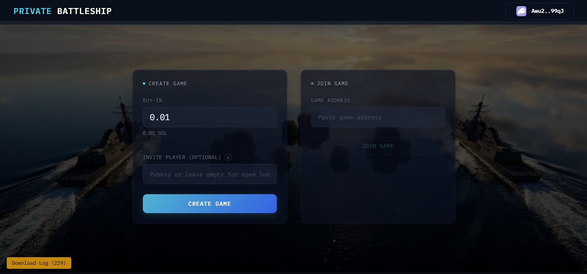
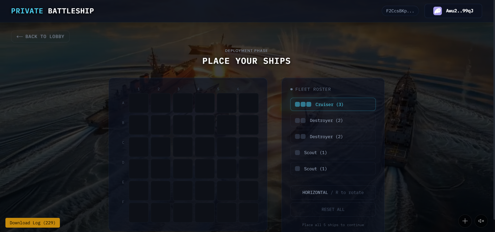
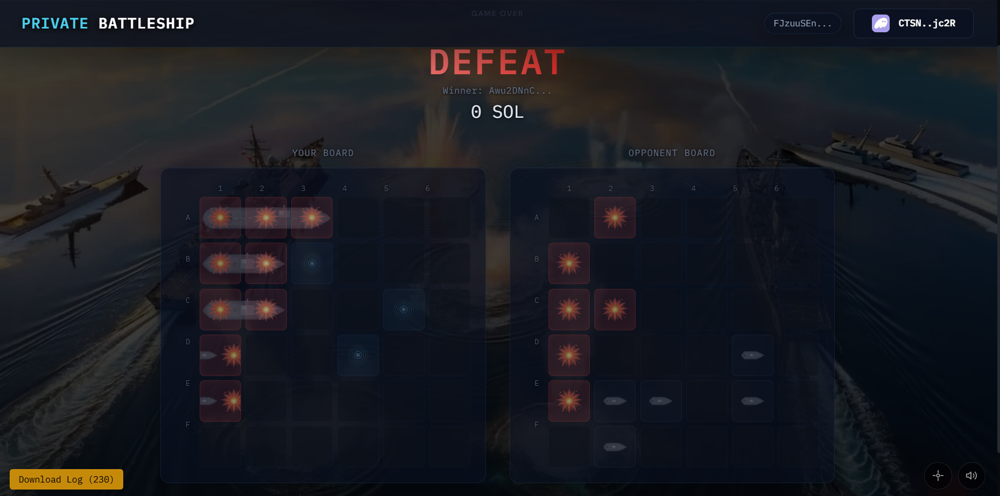
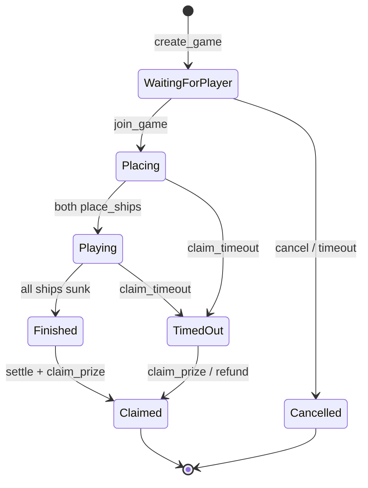
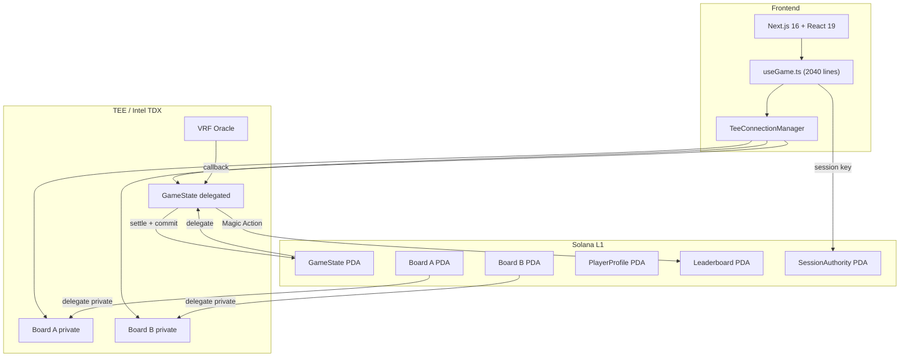
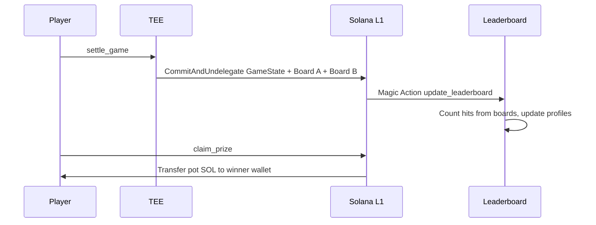

# Private Battleship


**MagicBlock Stack:** Ephemeral Rollups · PER/TEE (Intel TDX) · VRF Oracle · Session Keys · Magic Actions

Fully on-chain Battleship on Solana where your opponent cannot see your ships. Ship placements stay private inside Intel TDX hardware. Hit/miss results are public. Commit-reveal hashing proves nobody tampered with boards, even if the TEE were compromised.

**[Live Demo](https://private-battleship.vercel.app)** | **[Program on Solscan](https://solscan.io/account/9DiCaM3ugtjo1f3xoCpG7Nxij112Qc9znVfjQvT6KHRR?cluster=devnet)** | **[Source Code](https://github.com/Andy00L/private-battleship)**

## Screenshots







## How It Works

Two players. 6x6 grid. 5 ships (sizes 3, 2, 2, 1, 1). Take turns firing. First to sink all opponent ships wins the SOL pot. Every action is an on-chain transaction. Shots land in 30-50ms on the TEE.



## MagicBlock Integration

This project uses 5 MagicBlock products. Here is exactly how each one is used:

### 1. Private Ephemeral Rollups (PER with Private ACL)

Ship placements are invisible. Each PlayerBoard PDA is delegated to the TEE with a **private ACL** that restricts reads to the owner only. The `fire` instruction runs inside the TEE, reads the opponent's private board, and writes only hit/miss results to the public GameState.

```
create_game  -> CreatePermissionCpiBuilder(members: [Player A only])
join_game    -> CreatePermissionCpiBuilder(members: [Player B only])
fire         -> TEE reads private board, writes public hit board
settle_game  -> CommitAndUndelegate all 3 accounts back to L1
```

### 2. Ephemeral Rollups (Standard Delegation)

All 3 game accounts (GameState + Board A + Board B) are delegated to the same TEE validator for atomic execution. The `delegate_board` instruction uses `ctx.accounts.delegate_pda()` and the `delegate_game_state` uses `DelegatePermissionCpiBuilder`. Both pin to `TEE_VALIDATOR_PUBKEY`.

### 3. VRF Oracle

Neither player can rig who goes first. Both contribute a 32-byte seed at game creation/join. The program XORs both seeds and calls `create_request_randomness_ix`. The VRF callback sets `game.current_turn` based on `randomness[0] % 2`.

### 4. Magic Actions

At settlement, `settle_game` builds a `CallHandler` with `ShortAccountMeta` entries for the `update_leaderboard` instruction. This runs on the base layer AFTER the TEE commits. It updates both PlayerProfiles (total_shots_fired, total_hits) and the Leaderboard, computed from the hit board cell counts.

### 5. Pricing Oracle

The frontend reads the SOL/USD price from MagicBlock's real-time pricing oracle at `ENYwebBThHzmzwPLAQvCucUTsjyfBSZdD9ViXksS4jPu` on the TEE devnet. The oracle uses Pyth-compatible PriceUpdateV2 format. The price is cached for 30 seconds and displayed as a USD equivalent next to the SOL buy-in. The contract deals exclusively in lamports (no price-drift vulnerability).

## Architecture



## Settlement Flow



## On-Chain Program

`9DiCaM3ugtjo1f3xoCpG7Nxij112Qc9znVfjQvT6KHRR` on devnet. 1796 lines of Rust. 19 instructions + 1 auto-generated (`process_undelegation`).

| # | Instruction | Layer | Description |
|---|---|---|---|
| 1 | `initialize_profile` | Base | Create PlayerProfile PDA |
| 2 | `initialize_leaderboard` | Base | Create Leaderboard PDA |
| 3 | `create_game` | Base | Game + Board A + ACL + buy-in deposit |
| 4 | `join_game` | Base | Board B + ACL + buy-in deposit |
| 5 | `cancel_game` | Base | Refund Player A |
| 6 | `delegate_board` | Base | Board to TEE |
| 7 | `delegate_game_state` | Base | GameState to TEE with public ACL |
| 8 | `request_turn_order` | Base | VRF with XOR of both seeds |
| 9 | `callback_turn_order` | VRF | Set first turn |
| 10 | `register_session_key` | Base | Popup-free signing for 1 hour |
| 11 | `revoke_session_key` | Base | Close session key account |
| 12 | `place_ships` | TEE | 5 ships on 6x6 grid, validated |
| 13 | `fire` | TEE | Hit/miss/sunk/win detection |
| 14 | `update_leaderboard` | Magic Action | Stats from hit boards at settlement |
| 15 | `settle_game` | TEE | Commit + undelegate all 3 accounts |
| 16 | `claim_prize` | Base | Winner gets pot, session key supported |
| 17 | `claim_timeout` | Base | 3 status branches |
| 18 | `verify_board` | Base | Commit-reveal proof |
| 19 | `reset_active_games` | Base | Stale counter recovery |

### Account Layout

| Account | Size | PDA Seeds |
|---|---|---|
| GameState | 446 bytes | `["game", player_a, game_id_le]` |
| PlayerBoard | 136 bytes | `["board", game, player]` |
| PlayerProfile | 58 bytes | `["profile", player]` |
| Leaderboard | 455 bytes | `["leaderboard"]` |
| SessionAuthority | 113 bytes | `["session", game, player]` |

### Privacy Model

| Data | Owner | Opponent | Public |
|---|---|---|---|
| Ship positions | Yes | No | No (TEE only) |
| Hit/miss results | Yes | Yes | Yes |
| Board hash | Yes | Yes | Yes |
| Salt | Yes (local) | No | No |

After `settle_game`, boards are committed to L1. Anyone can call `verify_board` with the salt to prove the TEE didn't tamper.

## Frontend

4334 lines across 10 components, 1 hook, 6 utilities.

**Session keys** eliminate wallet popups during gameplay. `place_ships`, `fire`, and `settle_game` all use session key signing (registered once, valid 1 hour).

**TX batching** reduces setup popups. Player A: profile + create_game + register_session_key in 1 TX. Player B: profile + join_game + delegate_board + register_session_key in 1 TX.

**Auto end-game flow**: settle (session key on TEE, 0 popups), poll L1 confirmation (up to 90s), auto-claim (wallet, 1 popup for winner).

**Sound effects**: 6 naval sounds (hit/miss/sunk for both perspectives). Independent SFX toggle.

**Recent shot highlighting**: 3 most recent shots show color-coded animated borders (orange=hit, cyan=miss, red=sunk), 5s CSS fade.

**Multi-cell ship SVGs**: ship-2.svg spans 2 cells, ship-3.svg spans 3 cells. Vertical ships use CSS rotate + translateX correction.

| Constant | Value |
|---|---|
| Buy-in range | 0.001 - 100 SOL |
| Grid | 6x6 (36 cells) |
| Ships | 3, 2, 2, 1, 1 |
| Timeout | 300 seconds |
| Max concurrent games | 3 |
| Session key duration | 3600 seconds |

## Security

- 36 error codes (6000-6035) covering every edge case
- `pot_lamports` zeroed after `claim_prize` (no double-claim)
- `claim_timeout`: 3 separate branches for WaitingForPlayer, Placing, Playing
- Defense-in-depth `require!(claimer == player_a)` in WaitingForPlayer timeout
- Session keys scoped per game, validated via `resolve_player` on every call
- `claim_prize` sends SOL to `winner_wallet` (validated), not the session key signer
- TEE attestation: 3 retries with backoff. Mainnet: strict. Devnet: fallback.
- Stale `active_games` recovery via `reset_active_games` + pre-emptive profile check
- `verifyBoard` retry with fresh blockhash for devnet RPC lag
- `preflightCommitment: "confirmed"` aligned with blockhash commitment

## Limitations

- Leaderboard holds 10 entries max (no eviction)
- Devnet only
- Phantom wallet only
- Settlement takes 30-40s on devnet
- Per-shot stats computed at settlement, not during gameplay

## Documentation

| File | Contents |
|---|---|
| [ARCHITECTURE.md](ARCHITECTURE.md) | System design, diagrams, CPI map, design decisions |
| [app/README.md](app/README.md) | Frontend components, hook API, utilities |

## License

MIT
