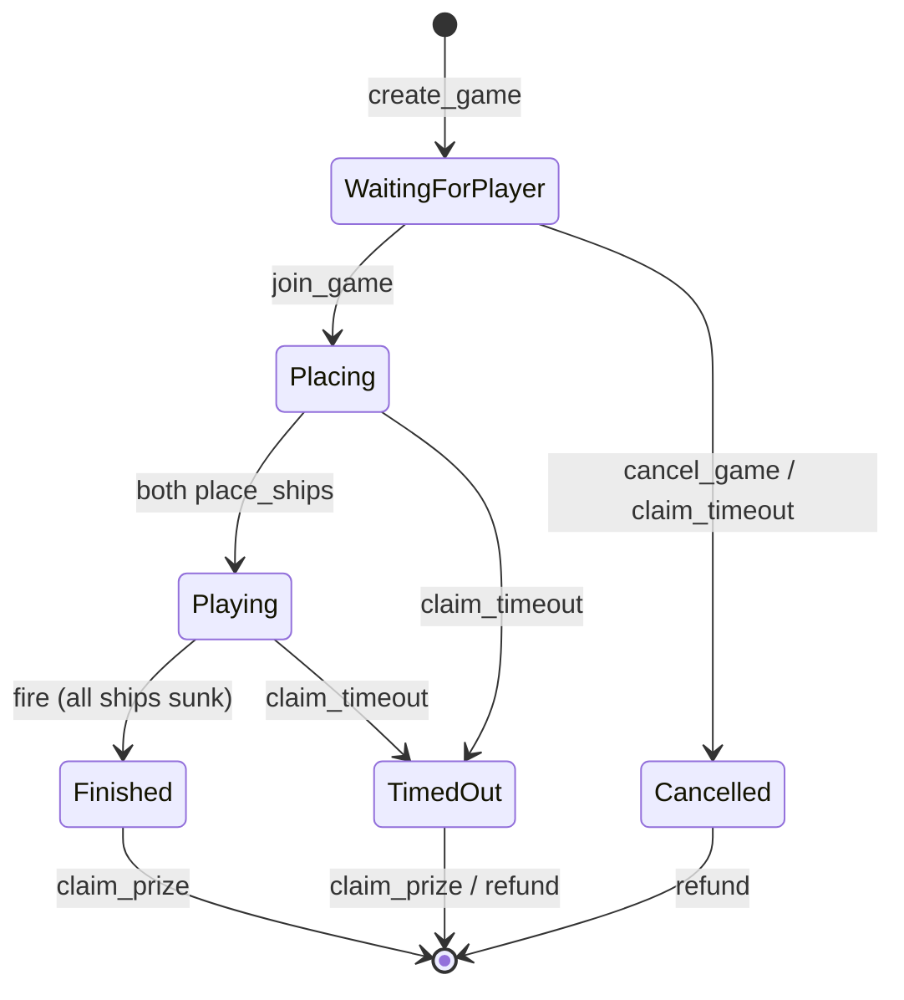
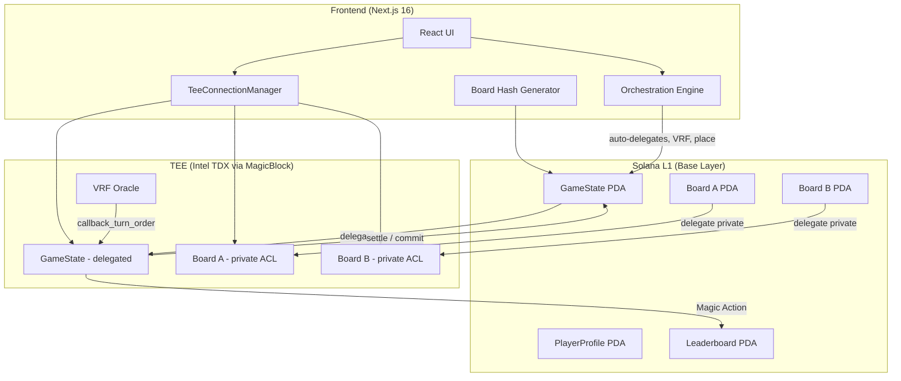
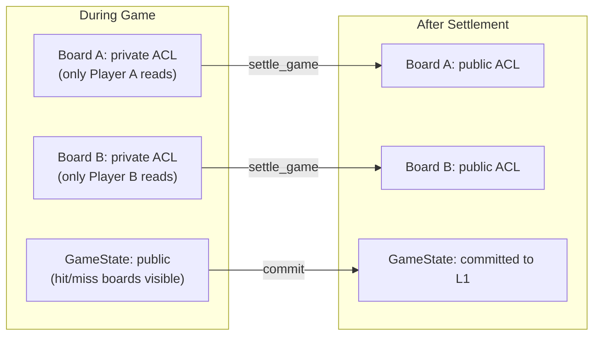

# Private Battleship

Fully on-chain Battleship on Solana where your opponent cannot see your ships. Ship placements stay private inside Intel TDX hardware (TEE), hit/miss results are public, and commit-reveal hashing proves nobody tampered with boards after the fact.

Built with five MagicBlock products: Private Ephemeral Rollups, Ephemeral Rollups, VRF, Magic Actions, and Pricing Oracle.

## Quick Start

```bash
# Prerequisites: Solana CLI (agave 3.1.9+), Anchor CLI 1.0.0, Node 18+, Rust 1.89+

# 1. Build the on-chain program (from project root)
anchor build

# 2. Deploy to devnet
anchor deploy --provider.cluster devnet

# 3. Run the frontend
cd app
npm install
npm run dev
# Open http://localhost:3000
```

The program deploys to `9DiCaM3ugtjo1f3xoCpG7Nxij112Qc9znVfjQvT6KHRR` on devnet.

## How the Game Works

Two players. Each has a 6x6 grid. Each places 5 ships (sizes 3, 2, 2, 1, 1). Players take turns firing at coordinates. First to sink all opponent ships wins the pot.

Every action is an on-chain transaction. Ship placements are invisible to everyone except the owner. Shots land in 30-50ms via TEE. VRF determines who goes first using combined seeds from both players (neither can rig it).

Buy-ins range from 0.001 SOL to 100 SOL. Winner takes the full pot. Players can run up to 3 concurrent games.



## Architecture



## Project Structure

```
solana-blitz-v3/
  Anchor.toml                              # Workspace config (program ID, cluster)
  Cargo.toml                               # Rust workspace config
  rust-toolchain.toml                      # Rust 1.89.0
  programs/battleship/
    Cargo.toml                             # anchor-lang 0.32.1, SDK deps
    src/lib.rs                             # Anchor program (16 instructions, 1522 lines)
  app/                                     # Next.js 16 frontend
    package.json                           # next 16.2.2, react 19.2.4
    src/
      app/                                 # App Router (layout, page, globals.css)
      components/                          # 7 React components
      hooks/useGame.ts                     # Game state + orchestration (1127 lines)
      lib/                                 # Utilities (TEE, board hash, oracle, program)
```

## On-Chain Program

16 instruction handlers across 4 phases, 4 account types, 28 error codes.

| # | Instruction | Phase | Description |
|---|-------------|-------|-------------|
| 1 | `initialize_profile` | Setup | Create PlayerProfile PDA (one-time per player) |
| 2 | `initialize_leaderboard` | Setup | Create global Leaderboard PDA (one-time admin) |
| 3 | `create_game` | Base Layer | Create game + board A + permission ACL + deposit buy-in |
| 4 | `join_game` | Base Layer | Create board B + permission ACL + deposit buy-in |
| 5 | `cancel_game` | Base Layer | Refund player A if no opponent joined |
| 6 | `delegate_board` | Base Layer | Delegate player board to TEE (called twice, once per player) |
| 7 | `delegate_game_state` | Base Layer | Delegate GameState to TEE with public ACL |
| 8 | `request_turn_order` | Base Layer | VRF randomness request with XOR of both seeds |
| 9 | `callback_turn_order` | VRF Callback | Set first turn from VRF randomness |
| 10 | `place_ships` | TEE | Place 5 ships on 6x6 grid with full validation |
| 11 | `fire` | TEE | Shoot at opponent grid, check hit/miss/sunk/win |
| 12 | `update_leaderboard` | Magic Action | Post-commit leaderboard update on base layer |
| 13 | `settle_game` | TEE | Commit state, reveal boards, undelegate all accounts |
| 14 | `claim_prize` | Base Layer | Winner withdraws pot, update both profiles |
| 15 | `claim_timeout` | Base Layer | Claim on opponent inactivity (3 status branches) |
| 16 | `verify_board` | Base Layer | Commit-reveal hash verification (anyone can call) |

### Account Layout

| Account | Size (bytes) | PDA Seeds | Permission |
|---------|-------------|-----------|------------|
| GameState | 446 | `["game", player_a, game_id_le]` | Public (after delegation) |
| PlayerBoard | 136 | `["board", game, player]` | Private (owner-only ACL) |
| PlayerProfile | 58 | `["profile", player]` | Base layer (never delegated) |
| Leaderboard | 455 | `["leaderboard"]` | Base layer (never delegated) |

All accounts use fixed-size arrays. No `Vec` in any account struct.

### Game Constants

| Constant | Value |
|----------|-------|
| `TIMEOUT_SECONDS` | 300 (5 minutes) |
| `MIN_BUY_IN` | 1,000,000 lamports (0.001 SOL) |
| `MAX_BUY_IN` | 100,000,000,000 lamports (100 SOL) |
| `MAX_ACTIVE_GAMES` | 3 per player |
| `MAX_LEADERBOARD_ENTRIES` | 10 |
| Grid size | 6x6 (36 cells) |
| Ship sizes | 3, 2, 2, 1, 1 (5 ships, 9 total cells) |

### Error Codes

28 error codes from 6000 to 6027. Key ones:

| Code | Name | When |
|------|------|------|
| 6000 | GameFull | Joining a game that already has two players |
| 6007 | OutOfBounds | Ship placement or fire coordinates outside 6x6 |
| 6009 | NotYourTurn | Firing when it's the opponent's turn |
| 6011 | AlreadyFired | Firing at a cell that was already targeted |
| 6022 | BoardTampered | verify_board hash mismatch (TEE tampering detected) |
| 6025 | BoardsNotDelegated | Trying to delegate game state before both boards |
| 6027 | InvalidOpponentProfile | Wrong opponent profile PDA in claim_timeout |

## Privacy Model

Ship placements are invisible during gameplay. Here is what each party can see:

| Data | Owner | Opponent | Spectators | Validators |
|------|-------|----------|------------|------------|
| Ship positions | Yes | No | No | No (TEE only) |
| Hit/miss results | Yes | Yes | Yes | Yes (public GameState) |
| Board hash | Yes | Yes | Yes | Yes (committed at game creation) |
| Salt | Yes (local) | No | No | No (revealed post-game) |

After `settle_game`, both board ACLs are set to public. Anyone can then call `verify_board` with the player's salt to cryptographically prove the TEE didn't modify ship positions.



## Frontend

Next.js 16 (App Router) with TypeScript, Tailwind CSS 4, and framer-motion.

| Component | Purpose |
|-----------|---------|
| `GameLobby` | Create game (buy-in + optional invite) or join by address |
| `PlacementPhase` | Click-to-place 5 ships on 6x6 grid, R key to rotate |
| `BattlePhase` | Two grids side-by-side, click enemy grid to fire |
| `BattleGrid` | Reusable 6x6 grid with A-F/1-6 labels, hit/miss/ship/water cells |
| `TransactionLog` | Real-time TX log sidebar with latency and result color coding |
| `ResultPhase` | Revealed boards, claim prize button, verify board button |
| `wallet-provider` | Phantom wallet adapter on Solana devnet |

The `useGame` hook (1127 lines) manages the entire game lifecycle. It includes an orchestration engine that automatically handles the multi-step delegation and VRF flow after a player creates or joins a game. The player only needs to place ships and fire; everything else (board delegation, VRF request, game state delegation) happens automatically.

Commit-reveal data (salt and ship placements) persists in `sessionStorage`, so refreshing the browser mid-game doesn't lose the data needed for post-game `verify_board`.

| Utility | File | Purpose |
|---------|------|---------|
| TEE Connection | `lib/tee-connection.ts` | Auth token management with 4-min auto-refresh |
| Board Hash | `lib/board-hash.ts` | SHA-256 hash generation (matches on-chain `verify_board`) |
| Oracle | `lib/oracle.ts` | SOL/USD price display via MagicBlock Pricing Oracle |
| Program | `lib/program.ts` | PDA derivation, Anchor program factory, all program addresses |

## Dependencies

### On-Chain (Rust)

| Crate | Version | Purpose |
|-------|---------|---------|
| `anchor-lang` | =0.32.1 | Anchor framework |
| `ephemeral-rollups-sdk` | =0.8.6 | TEE delegation, permissions, Magic Actions |
| `ephemeral-vrf-sdk` | =0.2.3 | VRF randomness for turn order |
| `solana-program` | =2.2.1 | Solana runtime (pinned for compatibility) |

### Frontend (TypeScript)

| Package | Version | Purpose |
|---------|---------|---------|
| `next` | 16.2.2 | App framework |
| `react` / `react-dom` | 19.2.4 | UI library |
| `@solana/web3.js` | ^1.98.4 | Solana RPC client |
| `@coral-xyz/anchor` | ^0.32.1 | Anchor client |
| `@magicblock-labs/ephemeral-rollups-sdk` | ^0.10.3 | TEE delegation SDK |
| `@solana/wallet-adapter-*` | ^0.9.x / ^0.15.x | Wallet connection (Phantom) |
| `framer-motion` | ^12.38.0 | Animations |
| `@noble/hashes` | ^1.8.0 | SHA-256 for commit-reveal |
| `tweetnacl` | ^1.0.3 | Signing for TEE auth |
| `tailwindcss` | ^4 | Styling (dev) |
| `typescript` | ^5 | Type checking (dev) |

## Program Addresses

| Program/Account | Address |
|-----------------|---------|
| Battleship Program | `9DiCaM3ugtjo1f3xoCpG7Nxij112Qc9znVfjQvT6KHRR` |
| Delegation Program | `DELeGGvXpWV2fqJUhqcF5ZSYMS4JTLjteaAMARRSaeSh` |
| Permission Program | `ACLseoPoyC3cBqoUtkbjZ4aDrkurZW86v19pXz2XQnp1` |
| VRF Program | `Vrf1RNUjXmQGjmQrQLvJHs9SNkvDJEsRVFPkfSQUwGz` |
| VRF Oracle Queue | `Cuj97ggrhhidhbu39TijNVqE74xvKJ69gDervRUXAxGh` |
| Magic Program | `Magic11111111111111111111111111111111111111` |
| TEE Validator (devnet) | `FnE6VJT5QNZdedZPnCoLsARgBwoE6DeJNjBs2H1gySXA` |
| TEE RPC | `https://tee.magicblock.app` |
| TEE WebSocket | `wss://tee.magicblock.app` |

## Security

The contract has been through iterative security review. Key protections:

- **Double-claim prevention**: `pot_lamports` is zeroed after claim_prize, preventing re-entry.
- **Timeout safety**: Three separate branches in `claim_timeout` handle WaitingForPlayer (refund creator), Placing (refund both), and Playing (claimer wins). Each validates wallet addresses and profile PDAs.
- **Delegation overflow guard**: `boards_delegated` is checked `< 2` before incrementing in `delegate_board`.
- **Target validation**: `fire` instruction verifies the target board PDA belongs to the opponent, not the attacker.
- **Profile accounting**: `active_games` is decremented in every exit path (cancel, timeout, claim_prize) with `saturating_sub` to prevent underflow.
- **TEE atomicity**: All three accounts (GameState, Board A, Board B) delegate to the same TEE validator, ensuring they're in one execution context.
- **VRF fairness**: Combined seed is `seed_a XOR seed_b`. Neither player can predict or manipulate the outcome alone.
- **Commit-reveal integrity**: SHA-256 hash of ship placements + random salt is committed at game creation. Post-game verification proves the TEE didn't modify boards.
- **Concurrent game limit**: `MAX_ACTIVE_GAMES = 3` enforced at create and join.
- **Session persistence**: Board salt and placements stored in `sessionStorage` keyed by game PDA. Survives page refreshes.

## Limitations

- **Leaderboard capacity**: Holds 10 entries max. When full, new winners with no existing entry are silently dropped.
- **Oracle stub**: `getSolPriceUsd` returns 0. The MagicBlock Oracle account format is not yet integrated, so buy-in USD display is non-functional.
- **No matchmaking**: Players share game addresses out-of-band or use the `invited_player` field. No lobby discovery.
- **No adjacency rules**: Ships can be placed adjacent to each other. This is by design (simpler validation), not a bug.
- **Devnet only**: The frontend is hardcoded to Solana devnet and the MagicBlock devnet TEE.
- **Single wallet**: Only Phantom wallet adapter is configured.
- **No spectator mode**: The public GameState could support spectating, but the frontend doesn't implement it.

## Documentation

| File | Contents |
|------|----------|
| [ARCHITECTURE.md](ARCHITECTURE.md) | System design, data flow diagrams, account relationships, design decisions |
| [app/README.md](app/README.md) | Frontend setup, component architecture, useGame hook, utilities |

## License

MIT
