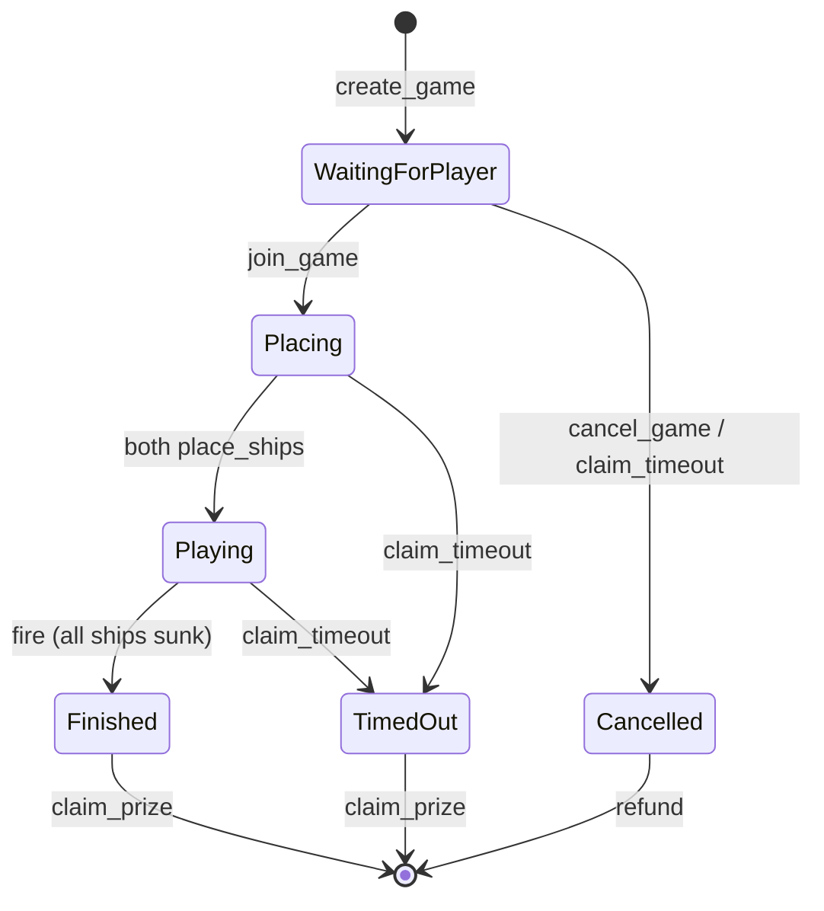
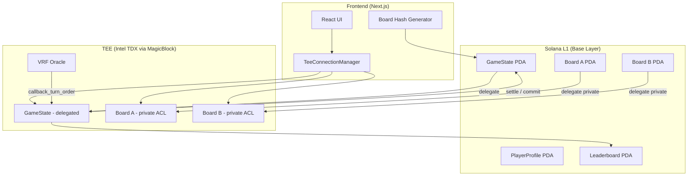

# Private Battleship

Fully on-chain Battleship on Solana where your opponent cannot see your ships. Ship placements stay private inside Intel TDX hardware (TEE), hit/miss results are public, and commit-reveal hashing proves nobody tampered with boards after the fact.

Built with five MagicBlock products: Private Ephemeral Rollups, Ephemeral Rollups, VRF, Magic Actions, and Pricing Oracle.

## Quick Start

```bash
# Prerequisites: Solana CLI (agave 3.1.9+), Anchor CLI 1.0.0, Node 18+, Rust 1.89+

# 1. Build the on-chain program
cd battleship
anchor build

# 2. Run the frontend
cd app
npm install
npm run dev
# Open http://localhost:3000
```

The program deploys to `9DiCaM3ugtjo1f3xoCpG7Nxij112Qc9znVfjQvT6KHRR`.

## How the Game Works

Two players. Each has a 6x6 grid. Each places 5 ships (sizes 3, 2, 2, 1, 1). Players take turns firing at coordinates. First to sink all opponent ships wins the pot.

Every action is an on-chain transaction. Ship placements are invisible to everyone except the owner. Shots land in 30-50ms via TEE. VRF determines who goes first using combined seeds from both players (neither can rig it).

Buy-ins range from 0.001 SOL to 100 SOL. Winner takes the full pot.



## Architecture



## Project Structure

```
battleship/
  programs/battleship/src/lib.rs   # Anchor program (16 instructions, 1488 lines)
  app/                             # Next.js 16 frontend
    src/
      app/                         # App Router (layout, page, globals.css)
      components/                  # 7 React components
      hooks/useGame.ts             # Game state management hook
      lib/                         # Utilities (TEE connection, board hash, oracle)
  tests/battleship.ts              # Anchor test scaffold
  Anchor.toml                      # Anchor workspace config
```

## On-Chain Program

16 instructions across 4 phases, plus 1 helper function:

| # | Instruction | Phase | Description |
|---|-------------|-------|-------------|
| 1 | `initialize_profile` | Setup | Create PlayerProfile PDA (one-time per player) |
| 2 | `initialize_leaderboard` | Setup | Create global Leaderboard PDA (one-time admin) |
| 3 | `create_game` | Base Layer | Create game + board A + permission ACL + deposit buy-in |
| 4 | `join_game` | Base Layer | Create board B + permission ACL + deposit buy-in |
| 5 | `cancel_game` | Base Layer | Refund player A if no opponent joined |
| 6 | `delegate_board` | Base Layer | Delegate player board to TEE (called twice) |
| 7 | `delegate_game_state` | Base Layer | Delegate GameState to TEE (public ACL) |
| 8 | `request_turn_order` | Base Layer | VRF randomness request with XOR of both seeds |
| 9 | `callback_turn_order` | VRF Callback | Set first turn from randomness |
| 10 | `place_ships` | TEE | Place 5 ships on 6x6 grid with validation |
| 11 | `fire` | TEE | Shoot at opponent grid, check hit/miss/sunk/win |
| 12 | `update_leaderboard` | Magic Action | Post-commit leaderboard update on base layer |
| 13 | `settle_game` | TEE | Commit state, reveal boards, undelegate |
| 14 | `claim_prize` | Base Layer | Winner withdraws pot, update both profiles |
| 15 | `claim_timeout` | Base Layer | Claim on opponent inactivity (3 status branches) |
| 16 | `verify_board` | Base Layer | Commit-reveal hash verification (anyone can call) |

### Account Layout

| Account | Size (bytes) | PDA Seeds | Permission |
|---------|-------------|-----------|------------|
| GameState | 446 | `["game", player_a, game_id_le]` | Public (after delegation) |
| PlayerBoard | 136 | `["board", game, player]` | Private (owner-only ACL) |
| PlayerProfile | 58 | `["profile", player]` | Base layer (never delegated) |
| Leaderboard | 455 | `["leaderboard"]` | Base layer (never delegated) |

### Game Constants

| Constant | Value |
|----------|-------|
| `TIMEOUT_SECONDS` | 300 (5 minutes) |
| `MIN_BUY_IN` | 1,000,000 lamports (0.001 SOL) |
| `MAX_BUY_IN` | 100,000,000,000 lamports (100 SOL) |
| `MAX_ACTIVE_GAMES` | 3 per player |
| `MAX_LEADERBOARD_ENTRIES` | 10 |
| Grid size | 6x6 (36 cells) |
| Ship sizes | 3, 2, 2, 1, 1 (5 ships, 9 total cells) |

### Error Codes

27 error codes from 6000 to 6026. Key ones:

| Code | Name | When |
|------|------|------|
| 6000 | GameFull | Joining a game that already has two players |
| 6007 | OutOfBounds | Ship placement or fire coordinates outside 6x6 |
| 6009 | NotYourTurn | Firing when it's the opponent's turn |
| 6011 | AlreadyFired | Firing at a cell that was already targeted |
| 6022 | BoardTampered | verify_board hash mismatch (TEE tampering detected) |

## Privacy Model

Ship placements are invisible during gameplay. Here is what each party can see:

| Data | Owner | Opponent | Spectators | Validators |
|------|-------|----------|------------|------------|
| Ship positions | Yes | No | No | No (TEE only) |
| Hit/miss results | Yes | Yes | Yes | Yes (public GameState) |
| Board hash | Yes | Yes | Yes | Yes (committed at game creation) |
| Salt | Yes (local) | No | No | No (revealed post-game) |

After `settle_game`, both board ACLs are set to public. Anyone can then call `verify_board` with the player's salt to cryptographically prove the TEE didn't modify ship positions.

## Frontend

Next.js 16 (App Router) with TypeScript, Tailwind CSS, and framer-motion.

| Component | Purpose |
|-----------|---------|
| `GameLobby` | Create game (buy-in + invite) or join by address |
| `PlacementPhase` | Click-to-place 5 ships on 6x6 grid, R to rotate |
| `BattlePhase` | Two grids side-by-side, click enemy grid to fire |
| `BattleGrid` | 6x6 grid with A-F/1-6 labels, hit/miss/ship/water cells |
| `TransactionLog` | Real-time TX log with latency and result color coding |
| `ResultPhase` | Revealed boards, claim prize, verify board |
| `wallet-provider` | Phantom wallet adapter on devnet |

Utility libraries:

| File | Purpose |
|------|---------|
| `tee-connection.ts` | TEE auth token management with 4-min auto-refresh |
| `board-hash.ts` | SHA-256 board hash generation (matches on-chain `verify_board`) |
| `oracle.ts` | SOL/USD price display via MagicBlock Pricing Oracle |

## Dependencies

### On-Chain (Rust)

| Crate | Version | Purpose |
|-------|---------|---------|
| `anchor-lang` | =0.32.1 | Anchor framework |
| `ephemeral-rollups-sdk` | =0.8.6 | TEE delegation, permissions, Magic Actions |
| `ephemeral-vrf-sdk` | =0.2.3 | VRF randomness for turn order |
| `solana-program` | =2.2.1 | Solana runtime (pinned for compatibility) |

### Frontend (TypeScript)

| Package | Version |
|---------|---------|
| `next` | 16.2.2 |
| `react` | 19.2.4 |
| `@solana/web3.js` | ^1.98.4 |
| `@coral-xyz/anchor` | ^0.32.1 |
| `@magicblock-labs/ephemeral-rollups-sdk` | ^0.10.3 |
| `framer-motion` | ^12.38.0 |
| `@noble/hashes` | ^2.0.1 |

## Program Addresses

| Program/Account | Address |
|-----------------|---------|
| Battleship Program | `9DiCaM3ugtjo1f3xoCpG7Nxij112Qc9znVfjQvT6KHRR` |
| Delegation Program | `DELeGGvXpWV2fqJUhqcF5ZSYMS4JTLjteaAMARRSaeSh` |
| Permission Program | `ACLseoPoyC3cBqoUtkbjZ4aDrkurZW86v19pXz2XQnp1` |
| VRF Oracle Queue | `Cuj97ggrhhidhbu39TijNVqE74xvKJ69gDervRUXAxGh` |
| VRF Program Identity | `9irBy75QS2BN81FUgXuHcjqceJJRuc9oDkAe8TKVvvAw` |
| TEE Validator (devnet) | `FnE6VJT5QNZdedZPnCoLsARgBwoE6DeJNjBs2H1gySXA` |
| TEE RPC | `https://tee.magicblock.app` |

## Security

4 audit passes found and fixed 10 bugs (0 critical, 3 high, 5 medium, 2 low):

- u8 overflow in ship coordinate computation (checked_add)
- Double-claim prevention (pot_lamports zeroed after claim)
- Wallet address validation in timeout refunds (inline require checks)
- PlayerProfile stats tracking in fire instruction
- Delegation overflow guard (boards_delegated < 2)
- PlaceShips other_player_board constraint (must belong to same game)

The commit-reveal hash scheme uses SHA-256. The client generates a random 32-byte salt, hashes `SHA256(ship_placements || salt)`, and commits the hash at game creation. Post-game, anyone can call `verify_board` with the original placements and salt to prove integrity.

## Limitations

- Leaderboard holds 10 entries max. When full, new winners are silently dropped.
- Oracle price integration is stubbed (returns 0 until MagicBlock Oracle account format is documented).
- Frontend game actions are scaffolded with simulated transactions. Production Anchor TX wiring is future work.
- No matchmaking system. Players share game addresses out-of-band or via invite pubkey.
- No adjacency rules for ship placement (by design, per CLAUDE.md spec).

## Documentation

- [ARCHITECTURE.md](ARCHITECTURE.md) - System design, data flow, account relationships
- [app/README.md](app/README.md) - Frontend setup and development

## License

MIT
