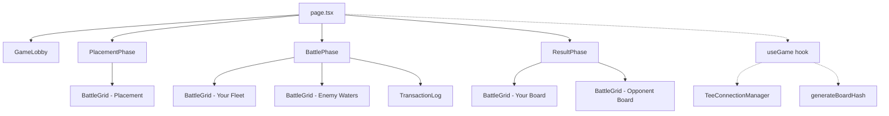

# Private Battleship - Frontend

[Back to main README](../README.md)

Next.js 16.2.2 frontend for the Private Battleship on-chain game. Dark military command center theme with real-time transaction logging.

## Setup

```bash
npm install
npm run dev
# Open http://localhost:3000
```

Build for production:

```bash
npm run build
npm start
```

## Stack

- Next.js 16.2.2 (App Router, Turbopack)
- React 19.2.4
- TypeScript (strict)
- Tailwind CSS 4
- framer-motion 12 (cell animations, result banners)
- @solana/wallet-adapter (Phantom, devnet)
- @noble/hashes (SHA-256 for commit-reveal)

## Components



Phase routing in `page.tsx` is based on `useGame().phase`:

| Phase | Condition | Component |
|-------|-----------|-----------|
| `lobby` | No game state, or Cancelled | `GameLobby` |
| `placing` | WaitingForPlayer or Placing status | `PlacementPhase` |
| `playing` | Playing status | `BattlePhase` |
| `finished` | Finished or TimedOut status | `ResultPhase` |

## BattleGrid Cell States

The `getCellState(cell, isOpponent)` function in `BattleGrid.tsx` determines cell appearance:

| Cell Value | isOpponent | State | Color |
|-----------|------------|-------|-------|
| 2 | any | hit | red-500 with X mark |
| 3 | any | miss | sky-900 with dot |
| 1 | false | ship | slate-600 |
| 0/1 | true | water | dark, hover: cyan border |

Grid dimensions: 6x6 (36 cells), 56px per cell, with A-F row labels and 1-6 column labels.

## Utilities

### TeeConnectionManager (`lib/tee-connection.ts`)

Manages authenticated WebSocket connections to the MagicBlock TEE at `https://tee.magicblock.app`.

- Verifies TEE hardware attestation via `verifyTeeRpcIntegrity` on init
- Acquires auth token by signing a message with the wallet
- Auto-refreshes token every 240 seconds (4 min, before 5-min expiry)
- Creates a `Connection` with the token embedded in the URL query param

### Board Hash (`lib/board-hash.ts`)

Generates the SHA-256 commit-reveal hash for ship placements.

```typescript
const { hash, salt } = generateBoardHash(placements);
// hash: 32-byte SHA-256(ship_bytes || salt)
// salt: 32-byte random, store locally for verify_board
```

Each ship is serialized as 4 bytes: `[startRow, startCol, size, horizontal ? 1 : 0]`. The salt is generated via `crypto.getRandomValues`. The hash matches the on-chain `solana_program::hash::Hasher` output.

### Oracle (`lib/oracle.ts`)

Frontend-only SOL/USD price display. Currently returns 0 (the Oracle price account format is not yet documented). The `formatBuyInDisplay` helper formats lamports as `"0.01 SOL (~$1.80)"` when a price is available.

## Theme

Dark naval command center. Background `#070a0f` with a subtle 60px grid overlay pattern. Fonts: DM Sans (body) and IBM Plex Mono (headers, data). Custom thin scrollbar. Card pattern: `bg-[#0f1520]/80 backdrop-blur-md border-slate-700/30 rounded-xl`.

[Back to main README](../README.md)
