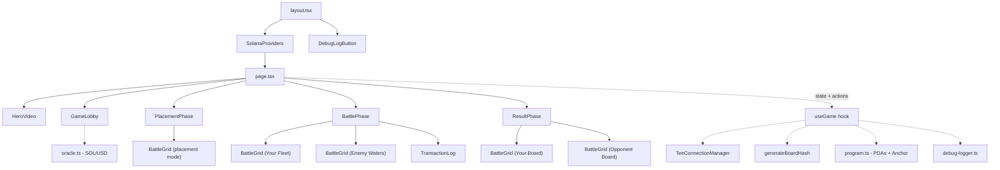
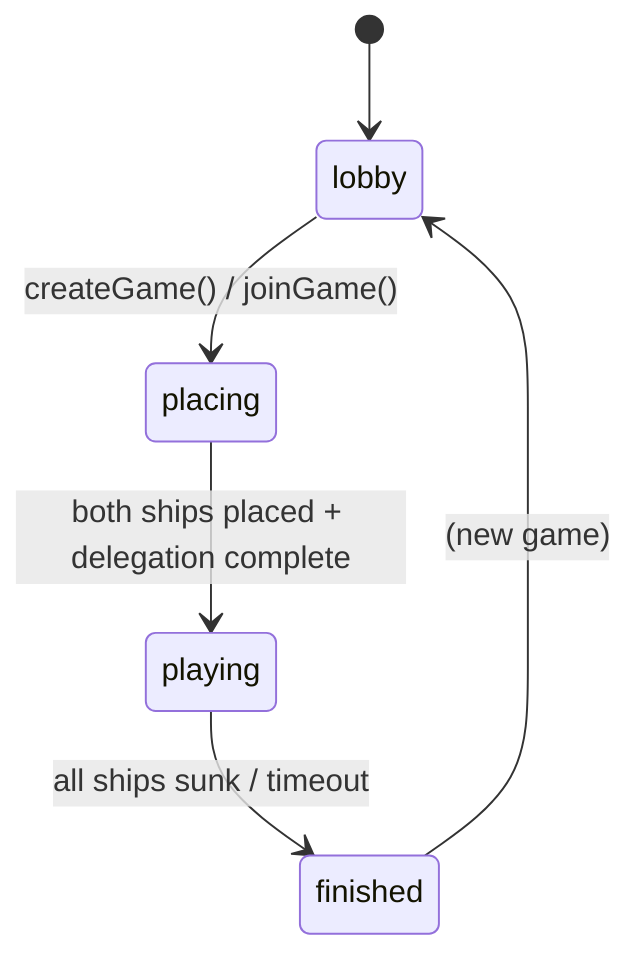
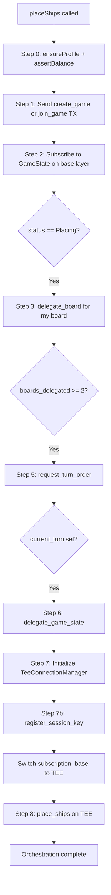
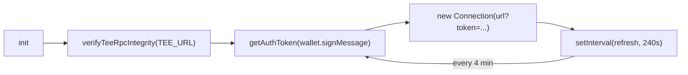

# Private Battleship - Frontend

[Back to main README](../README.md)

Next.js 16.2.2 frontend for the Private Battleship on-chain game. Dark military command center theme with real-time transaction logging and automated multi-step orchestration.

## Setup

```bash
npm install
npm run dev
# Open http://localhost:3000
```

Build for production:

```bash
npm run build
npm start
```

Requires Node 18+. Connects to Solana devnet and MagicBlock TEE at `https://tee.magicblock.app`.

## Environment Variables

| Variable | Default | Description |
|----------|---------|-------------|
| `NEXT_PUBLIC_DEBUG_LOG` | `true` (in .env.local) | Enable debug logger and floating download button |

## Stack

| Package | Version | Role |
|---------|---------|------|
| Next.js | 16.2.2 | App Router framework |
| React | 19.2.4 | UI library |
| TypeScript | ^5 | Strict mode |
| Tailwind CSS | 4 | Styling (via @tailwindcss/postcss) |
| framer-motion | ^12.38.0 | Cell animations, result banners |
| @solana/web3.js | ^1.98.4 | Solana RPC |
| @coral-xyz/anchor | ^0.32.1 | Program client |
| @magicblock-labs/ephemeral-rollups-sdk | ^0.10.3 | TEE delegation |
| @solana/wallet-adapter-* | ^0.9.x / ^0.15.x | Phantom wallet (devnet) |
| @noble/hashes | ^1.8.0 | SHA-256 for commit-reveal |
| tweetnacl | ^1.0.3 | Signing for TEE auth |

## Component Architecture



## Components

| Component | File | Lines | Purpose |
|-----------|------|-------|---------|
| `GameLobby` | `GameLobby.tsx` | 139 | Create game (buy-in + optional invite) or join by address |
| `PlacementPhase` | `PlacementPhase.tsx` | 296 | Click-to-place ships, R to rotate, fleet roster panel |
| `BattlePhase` | `BattlePhase.tsx` | 147 | Two grids + turn indicator + timeout bar + TX log |
| `BattleGrid` | `BattleGrid.tsx` | 113 | Reusable 6x6 grid with A-F/1-6 labels, framer-motion animations |
| `TransactionLog` | `TransactionLog.tsx` | 69 | Color-coded TX entries with latency (max 16 visible) |
| `ResultPhase` | `ResultPhase.tsx` | 110 | Winner/loser banner, both boards revealed, claim/verify buttons |
| `HeroVideo` | `HeroVideo.tsx` | 27 | Full-screen looping video background with dark overlay |
| `DebugLogButton` | `DebugLogButton.tsx` | 23 | Floating bottom-left button, downloads debug log, env-gated |
| `wallet-provider` | `wallet-provider.tsx` | 24 | ConnectionProvider + WalletProvider + WalletModalProvider (Phantom, devnet) |

## Phase Routing

Phase routing in `page.tsx` is driven by `useGame().phase`:

| Phase | Condition | Component | What Happens |
|-------|-----------|-----------|--------------|
| `lobby` | No game, or Cancelled | `GameLobby` | Create or join a game |
| `placing` | WaitingForPlayer or Placing | `PlacementPhase` | Place ships, orchestration runs in background |
| `playing` | Playing status | `BattlePhase` | Take turns firing at opponent grid |
| `finished` | Finished or TimedOut | `ResultPhase` | View boards, claim prize, verify board |



## BattleGrid Cell States

The `getCellState(cell, isOpponent)` function in `BattleGrid.tsx` determines cell appearance:

| Cell Value | isOpponent | State | Visual |
|-----------|------------|-------|--------|
| 2 | any | hit | red-500 with X mark |
| 3 | any | miss | sky-900 with dot |
| 1 | false | ship | slate-600 (your own ship) |
| 0 or 1 | true | water | dark bg, hover: cyan border + crosshair cursor |

Grid dimensions: 6x6 (36 cells), 56px per cell, 1.5px gap. Row labels A through F, column labels 1 through 6.

The grid uses `framer-motion` for hover scaling (1.08x) and tap compression (0.92x) on clickable cells. A last-hit animation plays a 0.4s scale pulse on the most recent hit cell.

## useGame Hook

The central state manager for the entire game (1563 lines). Returns phase, game state, grids, and action functions.

### State

| Field | Type | Description |
|-------|------|-------------|
| `phase` | `"lobby" \| "placing" \| "playing" \| "finished"` | Current UI phase |
| `gameState` | `GameStateData \| null` | Parsed on-chain game state |
| `gamePda` | `PublicKey \| null` | Current game address |
| `myGrid` | `number[]` | Player's own board (36 cells) |
| `opponentHits` | `number[]` | Hit/miss board for opponent's grid |
| `isMyTurn` | `boolean` | Whether it's this player's turn |
| `shipsRemainingMe` | `number` | Player's remaining ships |
| `shipsRemainingOpponent` | `number` | Opponent's remaining ships |
| `lastHit` | `{row, col} \| null` | Most recent hit for animation |
| `txLog` | `TxEntry[]` | Transaction history |
| `isWinner` | `boolean` | Whether this player won |
| `prizeClaimed` | `boolean` | Whether prize has been claimed |
| `boardSalt` | `Uint8Array \| null` | Salt for verify_board |
| `setupStatus` | `string` | Status message during orchestration |
| `setupError` | `string \| null` | Error message if orchestration fails |
| `error` | `string \| null` | Top-level error (balance, validation) |
| `timeoutDeadline` | `number \| null` | Timestamp when 5-min timeout is claimable |

### Actions

| Function | What It Does |
|----------|--------------|
| `createGame(buyInLamports, invitedPlayer)` | Start a new game. Generates board hash, stores salt. |
| `joinGame(gameAddress)` | Join an existing game by its PDA address. |
| `placeShips(placements)` | Place ships on grid. Sends create/join TX, starts orchestration. |
| `fire(row, col)` | Fire at opponent's grid (TEE transaction, session key or wallet). |
| `claimPrize()` | Winner claims the pot. |
| `claimTimeout()` | Claim win by opponent inactivity. |
| `verifyBoard()` | Post-game hash verification using stored salt. |
| `retrySetup()` | Re-run orchestration after failure. |

### Orchestration Engine

After `placeShips()` sends the create/join transaction, the hook automatically runs through a multi-step setup:



Each step retries on transient network errors. Progress is tracked with refs (not React state) to avoid stale closures in subscription callbacks.

Auto-settlement: when the hook detects `status === Finished`, it automatically calls `settle_game` to commit results and reveal boards.

Auto-timeout recovery: when creating a game triggers `TooManyGames` (error 6020), the hook calls `autoClaimTimeouts()` to scan and claim timeouts on stale games, freeing up active game slots.

### Subscription Management

The hook maintains up to three concurrent subscriptions:

| Subscription | Target | Purpose |
|-------------|--------|---------|
| `baseSubRef` | GameState on Solana L1 | Track game creation, joins, delegation progress |
| `teeSubRef` | GameState on TEE | Track real-time game state during battle |
| `teeBoardSubRef` | PlayerBoard on TEE | Track own board state (ships, hits) |

Subscriptions switch from L1 to TEE after delegation completes. All subscriptions are cleaned up on component unmount or game reset.

## Utilities

### TeeConnectionManager (`lib/tee-connection.ts`)

Manages authenticated WebSocket connections to the MagicBlock TEE.



- Verifies TEE hardware attestation via `verifyTeeRpcIntegrity` before first use
- Acquires auth token by signing a message with the connected wallet
- Creates a `Connection` with the token as a URL query parameter (both HTTP and WebSocket)
- Auto-refreshes every 240 seconds (4 minutes, before the 5-minute expiry)
- `destroy()` clears the timer and nullifies the connection

### Board Hash (`lib/board-hash.ts`)

Generates the SHA-256 commit-reveal hash for ship placements.

```typescript
const { hash, salt } = generateBoardHash(placements);
// hash: 32-byte Uint8Array (SHA-256 of ship_bytes || salt)
// salt: 32-byte random Uint8Array (store locally for verify_board)
```

Each ship is serialized as 4 bytes: `[startRow, startCol, size, horizontal ? 1 : 0]`. The 32-byte salt is generated via `crypto.getRandomValues`. The output matches the on-chain `solana_program::hash::Hasher` used in `verify_board`.

Salt and placements are persisted to `sessionStorage` under key `battleship:{gamePda}` for cross-refresh survival.

### Oracle (`lib/oracle.ts`)

Frontend-only SOL/USD price display. Two exports:

| Function | Purpose |
|----------|---------|
| `getSolPriceUsd(connection)` | Fetch SOL price from Oracle account. Currently returns 0 (stub). |
| `formatBuyInDisplay(lamports, solPriceUsd)` | Format as `"0.01 SOL (~$1.80)"` or `"0.01 SOL"` if price unavailable. |

The Oracle price account address is a placeholder (`11111111111111111111111111111111`). USD display will work once the MagicBlock Pricing Oracle account format is integrated.

### Program (`lib/program.ts`)

All on-chain addresses, PDA derivation functions, and the Anchor program factory.

| Export | Type | Description |
|--------|------|-------------|
| `PROGRAM_ID` | `PublicKey` | Battleship program address |
| `PERMISSION_PROGRAM_ID` | `PublicKey` | MagicBlock Permission Program |
| `DELEGATION_PROGRAM_ID` | `PublicKey` | MagicBlock Delegation Program |
| `TEE_VALIDATOR` | `PublicKey` | Devnet TEE validator |
| `MAGIC_PROGRAM_ID` | `PublicKey` | Magic Program |
| `MAGIC_CONTEXT_ID` | `PublicKey` | Magic Context |
| `VRF_PROGRAM_ID` | `PublicKey` | VRF oracle program |
| `ORACLE_QUEUE` | `PublicKey` | VRF oracle queue |
| `SLOT_HASHES` | `PublicKey` | Sysvar SlotHashes |
| `getGamePda(playerA, gameId)` | `[PublicKey, number]` | Seeds: ["game", playerA, gameId_le_8bytes] |
| `getBoardPda(game, player)` | `[PublicKey, number]` | Seeds: ["board", game, player] |
| `getProfilePda(player)` | `[PublicKey, number]` | Seeds: ["profile", player] |
| `getLeaderboardPda()` | `[PublicKey, number]` | Seeds: ["leaderboard"] |
| `getProgramIdentityPda()` | `[PublicKey, number]` | Seeds: ["identity"] |
| `getSessionAuthorityPda(game, player)` | `[PublicKey, number]` | Seeds: ["session", game, player] |
| `getProgram(conn, wallet)` | `Program` | Create Anchor program instance from IDL |

PDA seeds match the Rust program constants: `"game"`, `"board"`, `"profile"`, `"leaderboard"`, `"identity"`, `"session"`.

### Debug Logger (`lib/debug-logger.ts`)

Categorized logging system with downloadable output. Controlled by `NEXT_PUBLIC_DEBUG_LOG` env var.

| Category | Used For |
|----------|----------|
| `TX` | Transaction sends and confirmations |
| `STATE` | Game state changes |
| `ORCH` | Orchestration step progress |
| `SUB` | Subscription events |
| `RPC` | RPC calls and responses |
| `WALLET` | Wallet connection events |
| `TEE` | TEE connection lifecycle |
| `USER` | User actions (create, join, fire) |
| `ERROR` | Error details with stack traces |
| `POLL` | Polling game state |
| `SESSION` | Session key registration and usage |

Methods: `log(category, message, data?)`, `error(message, err)`, `download()`, `isEnabled()`, `getLogCount()`.

The logger includes a custom JSON replacer that converts `PublicKey` to base58, `BN` to string, `Uint8Array` to `[Uint8Array length=N]`, and `bigint` to string.

## Theme

Dark naval command center aesthetic.

| Element | Value |
|---------|-------|
| Background | `#070a0f` |
| Foreground | `#e2e8f0` |
| Card bg | `#0f1520` at 80% opacity, backdrop-blur-md |
| Card border | `slate-700/30` |
| Grid overlay | 60px repeating pattern at 4% opacity |
| Body font | DM Sans |
| Mono font | IBM Plex Mono (headers, data, TX log) |
| Scrollbar | 6px thin, slate-700/30 |

Wallet adapter button styles are overridden in `globals.css` to match the dark theme.

[Back to main README](../README.md)
